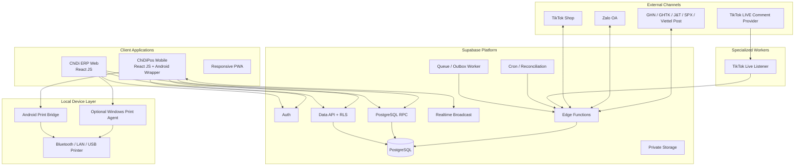

# KIẾN TRÚC HỆ THỐNG CHIDI ERP + CHIDIPOS
## Target Architecture sau V1.1

**Trạng thái hiện tại:** Hệ thống đã xây đến V1.1  
**Kiến trúc đích:** ERP vận hành + ChiDiPos TikTok-first + Zalo-assisted + Mobile-first  
**Frontend hiện hữu:** JavaScript / React JS / Vite  
**Database:** Supabase PostgreSQL Online  
**Nguyên tắc:** Không rewrite V1.1; mở rộng theo module, transaction và adapter.

---

# 0. Tóm tắt điều hành

ChiDi hiện đã có nền ERP V1.1 gồm workspace, thành viên, owner protection, audit, nhập hàng, thu chi, ledger, RPC ghi sổ/đảo và báo cáo server. Kiến trúc mới **không tạo một sản phẩm tách khỏi ERP**. ChiDiPos trở thành phân hệ Commerce / Live Commerce trên cùng nền dữ liệu.

```text
ChiDi ERP
│
├── ERP Core đã có
│   ├── Workspace
│   ├── Auth / Member
│   ├── Product master
│   ├── Purchase
│   ├── Cash
│   ├── Ledger
│   ├── Audit
│   └── Reporting
│
└── ChiDiPos mở rộng
    ├── Customer / CRM
    ├── Product Variant
    ├── Inventory Reservation
    ├── TikTok LIVE
    ├── Comment Parser
    ├── Chốt & In
    ├── Live Sale Ticket
    ├── Customer Basket / Cart
    ├── Zalo OA
    ├── Final Order
    ├── Shipping
    ├── COD
    ├── Return
    └── Commerce Reporting
```

Luồng mục tiêu:

```text
TikTok LIVE
→ Comment
→ Customer Match
→ Parser
→ Seller CHỐT & IN
→ Live Sale Ticket
→ Customer Cart
→ Zalo lấy thông tin / gửi tổng đơn
→ Customer Confirm
→ Final Order
→ Shipment
→ COD / Return
→ ERP Ledger / Reports
```

Các invariant cốt lõi:

```text
COMMENT ≠ SALE
PARSER ≠ SALE
CHỐT & IN = SELLER COMMIT
LIVE SALE TICKET = BẰNG CHỨNG CHỐT MẪU
CUSTOMER CART = TỔNG CÁC TICKET ĐÃ COMMIT
CUSTOMER CONFIRM = QUYỀN CHUYỂN THÀNH FINAL ORDER
FINAL ORDER = NGUỒN FULFILLMENT
DELIVERED ≠ COD SETTLED
```

---

# 1. Các quyết định kiến trúc không thay đổi từ V1.1

## 1.1 Modular Monolith trước, không microservice sớm

ChiDi tiếp tục dùng:

```text
React JS
+
Supabase
+
PostgreSQL
+
RLS
+
RPC
```

Không triển khai sớm Kubernetes, Kafka, nhiều microservice hoặc distributed transaction nếu chưa có bằng chứng tải thực tế.

Service riêng chỉ dùng khi runtime khác bản chất:

```text
TikTok Live Listener
Mobile Native Print Bridge
Optional Windows Print Agent
External integration workers
```

Business source of truth vẫn là PostgreSQL.

## 1.2 React không trực tiếp sửa ledger

Frontend chỉ thu thập input, validate UX, gửi command và hiển thị kết quả. Các nghiệp vụ thay đổi nhiều bảng phải đi qua PostgreSQL RPC hoặc trusted server function.

Ví dụ:

```text
post_purchase()
reverse_purchase()
commit_live_sale_ticket()
void_live_sale_ticket()
convert_customer_cart_to_order()
post_cod_settlement()
```

Không tạo ticket, cart item, reservation và print job bằng nhiều request độc lập từ React.

## 1.3 Workspace là tenant boundary

Mọi bảng business mới phải có `workspace_id` hoặc dẫn tới entity chứa `workspace_id`. Không cho entity workspace A tham chiếu entity workspace B.

## 1.4 Audit + reversal thay cho delete

Các chứng từ/ticket đã commit không xóa để sửa lịch sử. Dùng `VOID`, `REVERSE`, `CANCEL`, `ADJUST` cùng actor, timestamp, reason và source reference.

---

# 2. Trạng thái V1.1 hiện tại

## Đã có / đã xây

```text
Workspace selector
Member management
Owner-last protection
Audit
Server-side reports
Protection against stale session results
Purchase flow
Cash flow
Draft → Validate → Post → Reverse
PostgreSQL RPC
RLS foundation
Repository/demo adapter
```

## Gate còn phải đóng

```text
migration 002
Supabase Auth production
real-session acceptance
2-account authorization test
concurrent access test
backup/restore drill
cloud verification
```

Đây là **V1.1 Stabilization Gate**. Không migrate nghiệp vụ bán hàng production trước khi gate này đạt.

---

# 3. Kiến trúc sản phẩm đích



---

# 4. Client Strategy: Web core, Mobile-first operation

## 4.1 Web App

Web tiếp tục là client quản trị chính cho:

```text
Dashboard
Workspace
Member
Purchase
Cash
Catalog
Inventory
Orders
Customers
Reports
Finance
Integrations
System diagnostics
```

## 4.2 ChiDiPos Mobile

Mobile là client vận hành livestream:

```text
Comment
→ Parse
→ Chốt
→ In
→ Cart
→ Zalo
→ Tổng đơn
```

Ưu tiên màn hình:

```text
Live Console
Comment queue
Product suggestion
Variant picker
CHỐT & IN
Basket board
Customer cart
Reprint
Void
Customer information
Cart summary
Order confirmation
```

Không rewrite frontend hiện tại sang TypeScript. Tận dụng React JS hiện hữu và bọc Android bằng Capacitor hoặc native shell tương đương. Native bridge xử lý Bluetooth/LAN/USB printing.

## 4.3 Setup vận hành đề xuất

```text
Phone A → quay TikTok LIVE
Phone B / Android Tablet → ChiDiPos Mobile
Bluetooth/LAN Printer → bill mẫu
```

PC chỉ là lựa chọn cho back office hoặc máy in USB Windows.

---

# 5. Ranh giới domain

## ERP Core giữ từ V1.1

```text
workspaces
members
roles
products
suppliers
warehouses
purchase_documents
cash_documents
stock ledger hiện tại
cash ledger hiện tại
audit
reporting
source import
```

## ChiDiPos mở rộng

```text
Catalog / Variant
Inventory Reservation
CRM / Identity
Live Campaign
Live Session
Comments
Parser
Live Sale Ticket
Customer Cart
Orders
Shipping
COD
Returns
Print Jobs
Integration Health
```

---

# 6. Catalog / Variant

Mở rộng product master:

```text
products
product_variants
product_options
product_option_values
product_aliases
barcodes
price_lists
price_list_items
product_images
channel_product_mappings
```

Ví dụ product `CV49 - Short Jean Cargo` có variants:

```text
CV49-BLU-S
CV49-BLU-M
CV49-BLU-L
CV49-BLK-S
CV49-BLK-M
CV49-BLK-L
```

Alias phục vụ live:

```text
49
cv49
cv 49
mẫu 49
```

---

# 7. Inventory Architecture

## 7.1 Source of truth

Không dùng `products.stock` làm nguồn tồn có thẩm quyền.

```text
ON_HAND
RESERVED
AVAILABLE
IN_TRANSIT
DAMAGED
```

```text
AVAILABLE = ON_HAND - RESERVED
```

## 7.2 Reservation khác movement

Khi seller CHỐT & IN:

```text
ON_HAND không đổi
RESERVED tăng
AVAILABLE giảm
```

Comment không reserve stock.

## 7.3 Mở rộng ledger V1.1

Không rewrite ledger nhận hàng đã có. Migrate theo compatibility layer sang generalized stock ledger.

Entry types:

```text
PURCHASE_RECEIVE
PURCHASE_REVERSE
SALE_SHIP
SALE_RETURN
ADJUSTMENT_IN
ADJUSTMENT_OUT
TRANSFER_OUT
TRANSFER_IN
DAMAGE
RECOVERY
```

Reservation giữ bảng riêng `inventory_reservations`.

---

# 8. Live Campaign

Một ngày bán có thể nhiều live session nhưng cùng một campaign.

```text
Live Campaign 14/09/2026
├── Session 08:00
├── Session 14:00
└── Session 20:00
```

Cùng khách giữ cùng `Customer Number #027` trong campaign.

Tables:

```text
live_campaigns
live_sessions
live_campaign_customers
```

`live_campaign_customers` có:

```text
workspace_id
campaign_id
customer_id
external_user_id
customer_number
created_at
```

Unique:

```text
campaign_id + customer_number
campaign_id + customer identity
```

---

# 9. TikTok Integration Architecture

## 9.1 Tách TikTok Shop và TikTok LIVE

Hai adapter riêng:

```text
TikTok Shop Adapter
Comment Ingestion Provider
```

## 9.2 TikTok Shop Adapter

Khi quyền/API được cấp:

```text
seller authorization
shop mapping
product mapping
order sync
order detail
order status
package
shipping document
webhook
reconciliation
```

Secret chỉ ở server.

## 9.3 LIVE Comment Provider

Contract JavaScript:

```js
class CommentIngestionProvider {
  async connect() {}
  async disconnect() {}
  async healthCheck() {}
  async normalize(rawEvent) {}
}
```

Implementations có thể gồm:

```text
TikTokOfficialProvider
TikTokWebcastProvider
ApprovedPartnerProvider
ManualProvider
SimulatorProvider
```

Core chỉ nhận `NormalizedLiveComment`.

---

# 10. TikTok Live Listener

LIVE listener là long-running service, không phải browser tab.

## Free/Internal Mode

```text
Android/local device listener khi phiên bán hoạt động
```

Ưu điểm: ít chi phí. Nhược: phụ thuộc OS/device/network.

## Professional Mode

```text
Cloud long-running worker
```

Worker chỉ:

```text
connect
normalize
forward
retry
health check
```

Không chứa business rules.

---

# 11. Normalized Comment Contract

```js
{
  provider,
  workspaceId,
  campaignId,
  liveSessionId,
  externalCommentId,
  externalUserId,
  username,
  displayName,
  avatarUrl,
  text,
  createdAt,
  rawEventId,
  rawPayload
}
```

Deduplication key:

```text
workspace_id + provider + external_comment_id
```

---

# 12. Comment State Machine

```text
NEW
 ↓
PARSED
 ↓
READY
 ↓
CLAIMED
 ↓
COMMITTED
```

Branches:

```text
IGNORED
AMBIGUOUS
OUT_OF_STOCK
INVALID
```

## Comment Claim Lock

Hai staff không được chốt cùng comment. `claim_comment()` phải atomic. Nếu A claim trước, B nhận `COMMENT_ALREADY_CLAIMED`.

Realtime cập nhật mọi thiết bị nhưng database mới là source of truth.

---

# 13. Comment Parser

Parser V1 deterministic:

```text
normalize
→ tokenize
→ product alias
→ color
→ size
→ quantity
→ variant resolve
→ availability lookup
→ confidence
```

Ví dụ:

```text
49 xanh m 2c
```

→

```js
{
  productCode: "CV49",
  color: "BLUE",
  size: "M",
  quantity: 2,
  variantId: "...",
  confidence: 0.98
}
```

Dù confidence = 1.00, parser chỉ là suggestion. Sale chỉ commit khi seller bấm `CHỐT & IN`.

---

# 14. CHỐT & IN — Transaction trung tâm

Command:

```text
commit_live_sale_ticket()
```

Inputs:

```text
workspace_id
campaign_id
live_session_id
comment_id
customer_id
variant_id
quantity
unit_price
actor_id
idempotency_key
```

Atomic transaction:

```text
BEGIN
1 verify workspace membership
2 verify live session active
3 verify comment state
4 claim/lock comment
5 resolve/create campaign customer
6 resolve/create customer cart
7 lock inventory resource
8 verify AVAILABLE stock
9 create Live Sale Ticket
10 create Cart Item
11 create Inventory Reservation
12 create Print Job
13 append Audit
14 append Outbox Event
15 set comment COMMITTED
COMMIT
```

Bất kỳ bước nào fail → `ROLLBACK ALL`.

---

# 15. Live Sale Ticket

Live Sale Ticket là bằng chứng seller đã xác nhận một mẫu cho một khách.

Fields chính:

```text
id
workspace_id
campaign_id
live_session_id
customer_cart_id
customer_id
campaign_customer_id
source_comment_id
parse_result_id
ticket_no
product_id
variant_id
product_code_snapshot
product_name_snapshot
variant_snapshot
quantity
unit_price
line_total
status
print_status
reprint_count
committed_by
committed_at
voided_by
voided_at
void_reason
idempotency_key
```

Status:

```text
COMMITTED
VOIDED
```

Print state:

```text
QUEUED
PRINTING
PRINTED
FAILED
```

---

# 16. Reprint và Void

## Reprint

Reprint chỉ tạo print attempt mới cho cùng ticket. Không tăng quantity, không reserve thêm, không tạo ticket/cart item mới.

## Void

Void transaction:

```text
lock ticket
verify COMMITTED
mark VOIDED
void cart item
release reservation exactly once
audit
broadcast
```

Không DELETE.

---

# 17. Customer Basket Board

Kho thao tác bằng STT ngắn:

```text
#027 @dieu2004
3 món
197.000
✓ printed
Zalo waiting
```

Physical bill ưu tiên:

```text
#027
@dieu2004
CV49
BLUE / M
SL 1
LS-000184
```

Luồng kho:

```text
bill #027
→ lấy hàng
→ bỏ rổ #027
```

---

# 18. Customer Cart

Cart thuộc workspace + campaign + customer, không chỉ một session.

Fields:

```text
workspace_id
campaign_id
customer_id
campaign_customer_id
status
opened_at
summary_ready_at
summary_sent_at
customer_confirmed_at
converted_order_id
closed_at
```

States:

```text
OPEN
SUMMARY_READY
SUMMARY_SENT
CUSTOMER_CONFIRMED
CONVERTED
CANCELLED
```

Cart item luôn trace về Live Sale Ticket. UI có thể group SKU giống nhau nhưng DB giữ ticket gốc riêng để audit/void/reprint.

---

# 19. Customer Identity Architecture

Dùng:

```text
customers
customer_identities
customer_addresses
customer_tags
customer_merge_history
```

Identity types:

```text
TIKTOK_LIVE_USER
TIKTOK_SHOP_BUYER
ZALO_UID
PHONE
EMAIL
OTHER_CHANNEL
```

Matching priority:

```text
1 exact stable external ID
2 verified phone
3 existing channel buyer ID
4 explicit staff merge
5 fuzzy suggestion only
```

Không auto-merge vì tên/avatar giống nhau.

---

# 20. Zalo Architecture

Zalo dùng để:

```text
identity completion
customer information
cart summary
confirmation
post-sale communication
```

Không phải source of truth của cart.

## Free/manual

```text
ChiDiPos tạo Claim Code
→ customer nhắn Zalo
→ staff nhập/link thông tin
```

## Integrated

```text
Zalo OA
→ webhook
→ ChiDiPos
→ match Zalo UID
→ customer profile
```

---

# 21. Customer Claim Code

Entity `customer_claim_codes`:

```text
workspace_id
campaign_id
customer_cart_id
code
status
expires_at
claimed_customer_id
claimed_zalo_uid
created_at
claimed_at
```

Ví dụ `CD27-K8`.

Flow:

```text
Customer #27
→ issue CD27-K8
→ customer sends code through Zalo
→ webhook receives code
→ match Cart #27
→ link Zalo UID
```

---

# 22. Customer Information

Thông tin cần để finalize order:

```text
name
phone
province
district
ward
address line
shipping note
```

Không overwrite lịch sử address của order cũ. Final Order lưu address snapshot riêng.

---

# 23. Cart Summary

Tổng đơn chỉ tính từ `COMMITTED tickets + ACTIVE cart items`.

```text
CUSTOMER #27
CV49 / BLUE / M   2 x 69.000 = 138.000
NGO59 / BLACK / L 1 x 59.000 = 59.000
Tiền hàng: 197.000
Ship: 22.000
Cọc: 50.000
COD dự kiến: 169.000
```

Actions:

```text
COPY
SAVE IMAGE
SEND VIA ZALO
MARK SENT
CUSTOMER CONFIRMED
```

---

# 24. Customer Confirmation

Fields:

```text
confirmed_at
confirmed_by
confirmation_method
confirmation_reference
```

Methods:

```text
MANUAL
ZALO
PHONE
TIKTOK
OTHER
```

Không convert thành Final Order nếu policy yêu cầu confirmation mà chưa có.

---

# 25. Final Order

Core tables:

```text
orders
order_items
order_status_history
order_channel_refs
payments
refunds
returns
```

Sources:

```text
TIKTOK_LIVE_INTERNAL
TIKTOK_SHOP
POS
MANUAL
```

TikTok Live internal sale không mặc định là TikTok Shop checkout.

---

# 26. Convert Cart → Final Order

RPC:

```text
convert_customer_cart_to_order()
```

Transaction:

```text
BEGIN
1 lock cart
2 verify CUSTOMER_CONFIRMED
3 load active committed tickets
4 validate reservations
5 snapshot customer/address
6 snapshot prices
7 calculate total
8 create order
9 aggregate order lines
10 consume reservations according to policy
11 mark cart CONVERTED
12 append order status history
13 audit
14 outbox
COMMIT
```

Same idempotency key trả cùng order, không tạo order thứ hai.

---

# 27. Order State Machine

```text
DRAFT
↓
CONFIRMED
↓
READY_TO_FULFILL
↓
PACKING
↓
READY_TO_SHIP
↓
SHIPPED
↓
DELIVERED
↓
COMPLETED
```

Branches:

```text
CANCELLED
RETURNING
RETURNED
PARTIALLY_RETURNED
```

Payment và Shipping state tách riêng.

---

# 28. Fulfillment

Entities:

```text
shipments
shipment_packages
shipment_events
shipping_documents
```

Adapter:

```js
class ShippingProvider {
  async quote() {}
  async createShipment() {}
  async cancelShipment() {}
  async getLabel() {}
  async getTracking() {}
}
```

Providers:

```text
TikTok Shipping
GHN
GHTK
J&T
SPX
Viettel Post
Manual
```

---

# 29. Shipping Label vs Live Sale Ticket

`LIVE_SALE_TICKET`: in ngay trong live, gắn sản phẩm vào basket, giấy 58/80 mm.

`SHIPPING_LABEL`: sau Final Order, gắn package, A6/100x150.

Không dùng chung entity/status.

---

# 30. Printing Architecture

## Print Jobs

```text
workspace_id
device_id
printer_id
entity_type
entity_id
document_type
document_payload
document_url
storage_path
copies
status
attempts
created_at
claimed_at
printed_at
failed_at
last_error
```

Document types:

```text
LIVE_SALE_TICKET
CART_SUMMARY
SHIPPING_LABEL
```

## Android printing

```text
ChiDiPos Mobile
→ Native Print Bridge
→ Bluetooth / LAN / USB
→ Printer
```

Ưu tiên LAN/Wi-Fi hoặc Bluetooth.

## Windows printing

Optional:

```text
Web → Print Job → ChiDi Print Agent → Windows printer
```

---

# 31. Printer Failure Invariant

Business commit xảy ra trước physical print.

```text
CHỐT & IN
→ DB COMMIT
→ ticket/cart/reservation/print job tồn tại
→ device print attempt
```

Nếu printer fail:

```text
Ticket = COMMITTED
Cart = ACTIVE
Reservation = ACTIVE
Print Job = FAILED
```

Không mất sale.

---

# 32. Cash, Deposit và COD

Commerce phải phân biệt:

```text
Customer deposit
COD receivable
COD settlement
Bank transaction
Shipping fee
Refund
Owner capital
Operating expense
```

Không ghi COD bank receipt thành revenue mới nếu revenue đã được ghi từ order event.

---

# 33. Deposit

Deposit là payment entity, không chỉ boolean.

```text
workspace_id
customer_id
cart_id
order_id
payment_type
method
amount
status
reference
confirmed_by
confirmed_at
```

Types:

```text
DEPOSIT
ORDER_PAYMENT
REFUND
COD_RECEIPT
```

---

# 34. COD Reconciliation

Entities:

```text
cod_settlements
cod_settlement_lines
bank_transactions
settlement_matches
```

States:

```text
EXPECTED
PENDING
SETTLED
VARIANCE
REVERSED
```

Invariant:

```text
DELIVERED ≠ SETTLED
```

---

# 35. Returns

Return phải reference original order/line/quantity/cost allocation/shipment. Phân biệt return merchandise, refund cash, return shipping cost, damaged stock và resellable stock.

Không sửa order cũ để che lịch sử hoàn.

---

# 36. Giá vốn

Kiến trúc đích hướng tới cost lots + FIFO + sale-line allocations. Không lấy latest purchase price làm COGS tùy tiện.

Live Sale Ticket chưa ghi COGS. COGS ghi tại policy point Final Order / fulfillment theo chính sách đã duyệt.

---

# 37. Accounting Boundary

ChiDiPos không tự nhận là kế toán pháp định. Phân biệt:

```text
operational commerce
management finance
statutory accounting
```

Full accounting chỉ khi có chart of accounts, period, journal headers/lines, debit=credit, closing, AP/AR và reconciliation.

---

# 38. Outbox Pattern

Side effect external phải dựa trên outbox.

```text
Final Order committed
+
outbox ORDER_CREATED
```

Worker sau commit mới create shipment / send Zalo / sync TikTok. Không gọi API external ở giữa DB transaction.

---

# 39. Webhook Inbox

Webhook:

```text
verify
→ deduplicate
→ persist
→ acknowledge
→ process async
```

Assume duplicate, out-of-order, timeout, retry.

---

# 40. Reconciliation

Không tin webhook 100%.

Cron:

```text
recent orders reconcile
shipment reconcile
COD reconcile
channel inventory reconcile
integration token health
```

---

# 41. Permission Model

Existing roles:

```text
owner
manager
staff
viewer
```

Mở rộng permission granular:

```text
catalog.read
catalog.write
inventory.read
inventory.adjust
purchase.read
purchase.post
cash.read
cash.post
live.read
live.claim
live.commit
live.void
live.reprint
customer.read
customer.edit
customer.merge
order.read
order.confirm
order.cancel
fulfillment.read
fulfillment.create
fulfillment.cancel
finance.read
finance.reconcile
integration.manage
printer.manage
audit.read
```

Role là tập permissions; lâu dài không hardcode quyền chỉ bằng tên role.

---

# 42. Security

Frontend chỉ chứa Supabase public URL và publishable/anon key.

Không để frontend chứa:

```text
service role
TikTok secret/access token
Zalo secret
carrier secret
encryption key
```

Secrets ở Edge Function / worker secret store.

---

# 43. Idempotency & Concurrency

Critical commands phải idempotent:

```text
post purchase
reverse purchase
commit live ticket
void live ticket
convert cart to order
create shipment
post settlement
```

Concurrency tests bắt buộc:

```text
stock available = 1 → only one commit succeeds
same comment two staff → only one claim succeeds
same cart two devices → only one final order
```

Use row locks, unique constraints và lock order nhất quán.

---

# 44. Realtime

Realtime phục vụ UX, không phải source of truth.

Events:

```text
COMMENT_RECEIVED
COMMENT_CLAIMED
TICKET_COMMITTED
TICKET_VOIDED
CART_CHANGED
PRINT_STATUS_CHANGED
CUSTOMER_LINKED
ORDER_CREATED
```

Client mất event thì refetch state authoritative.

---

# 45. UI Information Architecture

```text
/dashboard
/purchases
/cash
/catalog/products
/catalog/variants
/catalog/aliases
/catalog/pricing
/inventory/stock
/inventory/movements
/inventory/reservations
/inventory/transfers
/inventory/stocktake
/live/campaigns
/live/sessions
/live/console
/live/basket-board
/live/carts
/live/tickets
/customers/all
/customers/identities
/customers/merge
/zalo/inbox
/zalo/claims
/orders/all
/orders/live
/orders/tiktok-shop
/orders/returns
/orders/exceptions
/fulfillment/packing
/fulfillment/shipments
/fulfillment/labels
/fulfillment/print-jobs
/finance/cashflow
/finance/deposits
/finance/cod
/finance/settlements
/reports
/settings/workspace
/settings/members
/settings/roles
/settings/tiktok
/settings/zalo
/settings/carriers
/settings/printers
/system/webhooks
/system/jobs
/system/dead-letter
/system/audit
/system/health
```

---

# 46. Live Console UX

```text
@dieu2004
49 xanh m 2c

Parser:
CV49
BLUE / M
Qty 2

Available: 12

[ CHỌN LẠI ]
[ CHỐT & IN ]
```

Sau commit:

```text
✓ Ticket LS-00184
✓ Basket #027
✓ Reserved 2
✓ Print queued
```

Nếu printer fail:

```text
⚠ Bill chưa in
[ IN LẠI ]
```

---

# 47. Basket Board UX

```text
#027 @dieu2004
3 món
197.000
Printed 3/3
Zalo ✓
Info ✓

#028 @linh2004
2 món
128.000
Printed 1/2
Zalo —
Info —
```

Filters:

```text
Open
Missing print
Missing Zalo
Missing customer info
Ready summary
Confirmed
```

---

# 48. Exception Center

Production phải có queue cho:

```text
Unparsed comment
Ambiguous variant
Out of stock
Duplicate claim
Print failed
Zalo claim unmatched
Customer missing info
Cart not confirmed
Shipment failed
Webhook failed
COD variance
Reconciliation mismatch
```

Mỗi exception có owner/status/created_at/last_attempt/action/resolution.

---

# 49. Reporting Principles

Mỗi KPI phải định nghĩa source tables, business date, timezone, included/excluded states và drill-down path.

Commerce KPIs:

```text
Comments
Parsed comments
Committed tickets
Void tickets
Comment → Commit %
Commit → Confirm %
Open carts
Confirmed carts
Revenue
Orders
AOV
Units/order
Top SKU
Top size
Top color
Top campaign
Print failure rate
Reprint rate
Available stock
Reserved stock
Low stock
Delivered
Return rate
COD expected
COD settled
COD variance
```

---

# 50. Deployment Strategy

## Free-first internal

```text
Static Web Hosting
Supabase Free
Android local print
Local/mobile listener where feasible
Manual Zalo fallback
Manual/API carrier depending availability
```

Nâng cấp khi có quota/reliability/backup/uptime/multi-shop/automation requirement.

## Professional

```text
Supabase paid when needed
Cloud listener
scheduled backup/PITR
monitoring
Zalo OA API
shipping APIs
error alerting
central logs
```

---

# 51. Backup & Observability

V1.1 stabilization phải có DB backup + restore test + documented recovery.

Every external flow log:

```text
correlation_id
request_id
workspace_id
integration
external_id
attempt
duration
result
```

Không log password, access token hoặc secrets.

---

# 52. Repository Evolution

Không rewrite toàn repo.

```text
src/
├── app/
├── components/
├── lib/
│   ├── domain.js
│   ├── repository.js
│   └── permissions.js
├── features/
│   ├── workspace/
│   ├── purchases/
│   ├── cash/
│   ├── catalog/
│   ├── inventory/
│   ├── live/
│   ├── customers/
│   ├── orders/
│   ├── fulfillment/
│   ├── finance/
│   └── reports/
└── mobile/
    └── device-bridge/

supabase/
├── migrations/
├── tests/
└── functions/
    ├── tiktok-webhook/
    ├── live-comment-ingest/
    ├── zalo-webhook/
    ├── shipping-webhook/
    ├── sync-tiktok/
    ├── send-zalo-message/
    └── reconciliation/

services/
└── tiktok-live-listener/

mobile/
└── android-wrapper/

docs/
├── architecture/
├── adr/
├── runbooks/
└── verification/
```

Tách dần `pages.jsx` theo feature khi module thật sự phát triển.

---

# 53. Data Migration Strategy từ V1.1

1. Freeze schema snapshot + verification report.  
2. Add new tables only; không xóa/rename table cũ ngay.  
3. Add compatibility views/functions.  
4. Migrate product identifiers sang product/variant model; unknown SKU giữ temporary flag.  
5. Introduce generalized inventory model.  
6. Reconcile old ledger totals vs new views.  
7. Retire compatibility layer chỉ sau acceptance.

---

# 54. Roadmap mới từ V1.1

## V1.1 — Current

Đã xây:

```text
Workspace
Member
Owner protection
Audit
Purchase
Cash
Ledger
Server report
Session stale-data protection
```

## V1.1.1 — Stabilization Gate

Tasks:

```text
migration 002
Supabase Auth production
2-account RLS test
owner/manager/staff/viewer real tests
concurrent tests
cloud RPC verification
backup + restore
acceptance session
```

Gate:

```text
No cross-workspace leak
No duplicate ledger posting
Restore success
Real users login/operate
```

## V1.2 — Commerce Foundation

```text
Product Variants
Aliases
Barcode
Customer
Customer Identity
Customer Address
Generalized Inventory
Reservation
Availability
Order skeleton
Payment skeleton
```

## V1.3 — TikTok Live + Mobile Chốt & In

```text
Live Campaign
Live Session
Campaign Customer STT
Comment Provider
Live Listener
Normalized Comments
Parser
Claim Lock
Live Sale Ticket
Customer Cart
CHỐT & IN RPC
Reservation
Print Job
Android Mobile UI
Native printer POC
Reprint
Void
Basket Board
Realtime
```

Gate:

```text
100+ parser tests
stock contention pass
double-click idempotency pass
two-staff claim pass
printer-offline recovery pass
```

## V1.4 — Zalo + Customer Finalization

```text
Claim Code
Zalo identity
Zalo OA adapter
Customer information
Address
Cart Summary
Deposit
Customer confirmation
convert cart to order
```

Manual fallback luôn tồn tại.

## V1.5 — Fulfillment + Shipping

```text
Shipment
Package
Carrier adapters
Shipping quote
Create shipment
Tracking
Shipping label
A6 print
Return flow
```

## V1.6 — COD + Commerce Finance

```text
COD expected
Settlement
Settlement lines
Bank matching
Shipping cost
Refund
Return cost
Gross profit
Campaign performance
```

## V1.7 — Production Hardening

```text
central health
dead-letter
reconciliation dashboard
rate limiting
circuit breaker
monitoring
alerting
query optimization
pagination
load testing
security review
backup automation
restore drill
```

## V2.0 — Multi-shop / SaaS readiness

Chỉ làm khi internal product ổn:

```text
merchant onboarding
billing
subscription
tenant limits
support tooling
central operations
SLA monitoring
```

---

# 55. Accounting Roadmap vẫn riêng

TikTok priority không xóa accounting roadmap. Sau commerce core mới phát triển AP/AR, journal, double-entry, period, closing, P&L, balance sheet, cash flow và subledger reconciliation khi policy/accountant xác nhận.

---

# 56. Acceptance Scenarios

## A — V1.1 Core

```text
Owner login
→ create workspace/member
→ create purchase draft
→ validate
→ post
→ ledger updated
→ report updated
→ reverse
→ ledger reversed
→ audit trace complete
```

## B — TikTok Live

```text
1 Start Campaign C001
2 Start Session L001
3 Listener receives comment
4 Comment inserted once
5 Customer matched
6 Parser resolves CV49 / BLUE / M
7 No stock reservation yet
8 Seller clicks CHỐT & IN
9 Comment claimed atomically
10 Ticket created
11 Basket #027 assigned
12 Cart item created
13 Reservation created
14 Print job queued
15 Mobile printer prints
16 Second comment repeats flow
17 Same customer cart accumulates tickets
18 Cart summary generated
19 Customer info linked via Zalo/manual
20 Customer confirms
21 Final Order created once
22 Shipment created
23 Shipping label printed
24 Shipment delivered
25 COD remains pending
26 Settlement matched
27 Reports updated
28 Audit drill-down works
```

## C — Printer Failure

```text
CHỐT & IN
→ DB commit success
→ printer disconnected
→ print job FAILED
→ ticket remains COMMITTED
→ cart remains correct
→ reservation remains active
→ reconnect
→ REPRINT
→ no duplicate item
```

## D — Concurrent Stock

```text
AVAILABLE = 1
Seller A commits variant X
Seller B commits variant X simultaneously
Expected: exactly one succeeds
```

## E — Same Comment Two Staff

```text
Comment C01
Staff A clicks
Staff B clicks
Expected: one claim / one ticket / one cart item / one reservation / one print job
```

## F — Zalo Match

```text
Customer #027
Claim CD27-K8
Zalo receives code
→ lookup active code
→ link Zalo UID
→ attach to same customer/cart
→ collect phone/address
→ no duplicate customer
```

---

# 57. Coding Rules

1. Giữ React JS/JSX cho app hiện tại.  
2. Không rewrite V1.1 sang TypeScript chỉ để modernize.  
3. Mọi schema change dùng migration.  
4. Mọi workspace table dùng RLS.  
5. Mọi critical command transactional.  
6. Mọi retried mutation idempotent.  
7. Không mutate inventory trực tiếp từ React.  
8. Comment không tự tạo sale.  
9. Parser chỉ suggestion.  
10. CHỐT & IN là commit boundary.  
11. Printer fail không làm mất sale.  
12. Reprint không duplicate business state.  
13. Không delete committed ticket.  
14. Final Order lưu price/address snapshot.  
15. Delivered không đồng nghĩa COD settled.  
16. Owner capital không phải revenue.  
17. External integrations dùng adapter.  
18. Webhooks dùng inbox/deduplication.  
19. Side effects dùng outbox/worker.  
20. Reconciliation bắt buộc cho hệ thống ngoài.  
21. Realtime là UX, DB là truth.  
22. Security enforced server-side.  
23. Reports phải drill-down tới source evidence.  
24. Existing V1.1 behavior không được regression.

---

# 58. Implementation Output Contract cho Coding Agent

Mỗi task phải trả:

```text
1 Current-state impact
2 Implementation plan
3 Files changed
4 Migration
5 RLS changes
6 RPC/business command
7 UI changes
8 Integration changes
9 Tests
10 Verification commands
11 Rollback plan
12 Acceptance criteria
13 Known limitations
```

Không chỉ pseudo-code.

---

# 59. Change Safety Checklist

```text
[ ] existing V1.1 tests pass
[ ] new migrations clean-run
[ ] migration upgrade from V1.1 passes
[ ] RLS tests pass
[ ] cross-workspace test passes
[ ] idempotency tested
[ ] concurrency tested
[ ] audit tested
[ ] reports unchanged unless intentionally modified
[ ] production build passes
[ ] no secret in frontend
[ ] backup/rollback documented
```

---

# 60. Definition of Done

```text
[ ] code complete
[ ] migration complete
[ ] no destructive undocumented migration
[ ] RLS complete
[ ] RPC/business invariant complete
[ ] unit test complete
[ ] integration test complete
[ ] critical E2E complete
[ ] concurrency test complete where relevant
[ ] build pass
[ ] real-device test where relevant
[ ] real-printer test where relevant
[ ] docs updated
[ ] verification updated
[ ] rollback documented
```

---

# 61. Mô hình dữ liệu đích rút gọn

```text
Workspace
│
├── Members / Roles / Permissions
├── Catalog
│   ├── Products
│   └── Variants
├── Procurement
│   ├── Purchase Docs
│   └── Supplier
├── Inventory
│   ├── Stock Ledger
│   ├── Reservation
│   └── Warehouse
├── CRM
│   ├── Customers
│   ├── Identities
│   └── Addresses
├── Live Commerce
│   ├── Campaign
│   ├── Session
│   ├── Comment
│   ├── Parse Result
│   ├── Campaign Customer #
│   ├── Sale Ticket
│   └── Cart
├── Sales
│   ├── Order
│   ├── Order Items
│   └── Payment
├── Fulfillment
│   ├── Shipment
│   ├── Package
│   └── Shipping Document
├── Finance
│   ├── Cash
│   ├── COD Settlement
│   └── Bank Match
└── Platform
    ├── Audit
    ├── Webhook Inbox
    ├── Outbox
    ├── Print Jobs
    └── Integration Health
```

---

# 62. Final Architecture Principle

ChiDi không cần xây hai hệ thống ERP và POS tách biệt.

```text
                    CHIDI PLATFORM
                          │
          ┌───────────────┼────────────────┐
          │               │                │
       ERP Core       ChiDiPos         Integrations
          │               │                │
 Purchase/Cash      Live/Sales         TikTok/Zalo
 Ledger/Audit       Cart/Order         Shipping
          │               │                │
          └───────────────┼────────────────┘
                          │
                   PostgreSQL Truth
```

ERP Core trả lời:

```text
tiền và hàng đến từ đâu
ai ghi
ghi khi nào
đảo thế nào
```

ChiDiPos trả lời:

```text
khách nào chốt mẫu gì
ở live nào
ai chốt
bill nào đã in
hàng ở basket nào
khách đã xác nhận chưa
đơn đã giao chưa
COD đã về chưa
```

Cả hai dùng chung workspace, product, customer, warehouse, inventory, audit, ledger và reports.

---

# 63. Master Prompt cho AI Coding Agent

```text
You are the principal engineer for ChiDi ERP + ChiDiPos.

The project already has a working V1.1 foundation.
Do not rewrite or replace it.

CURRENT FOUNDATION
- JavaScript
- React JS
- Vite
- Supabase PostgreSQL
- workspace selector
- member management
- audit
- owner protection
- server-side reports
- purchase/cash document flows
- posting/reversal RPC
- RLS foundation

PRIMARY RULE
Preserve all passing V1.1 behavior.

TARGET
Extend the same platform into TikTok-first Live Commerce.

CORE LIVE FLOW
TikTok Comment
→ Customer Match
→ Parser Suggestion
→ Seller CHỐT & IN
→ Atomic commit
→ Live Sale Ticket
→ Customer Basket
→ Customer Cart
→ Zalo/customer information
→ Customer Confirmation
→ Final Order
→ Shipment
→ COD/Return
→ ERP reports

NON-NEGOTIABLE INVARIANTS
1. Comment alone never creates a sale.
2. Parser alone never creates a sale.
3. CHỐT & IN is the business commit boundary.
4. commit_live_sale_ticket must be atomic.
5. A committed ticket is never deleted; use VOID.
6. Reprint never creates another sale.
7. Printer failure never loses committed business data.
8. Inventory cannot oversell under concurrency.
9. Inventory authority is server-side.
10. Realtime is not source of truth.
11. Every business table respects workspace isolation.
12. Every sensitive command is permission checked server-side.
13. Every retried mutation is idempotent.
14. Webhooks are deduplicated and asynchronously processed.
15. External side effects use outbox/workers.
16. Delivered does not mean COD settled.
17. COD settlement cannot create duplicate revenue.
18. Final Order stores historical price/address snapshots.
19. TikTok/Zalo/carriers are adapters, not core domain dependencies.
20. Existing V1.1 ledger behavior must not regress.

IMPLEMENTATION STYLE
- Keep current React JS/JSX.
- Do not convert the existing project to TypeScript.
- Use migrations.
- Prefer PostgreSQL RPC for multi-table authoritative transactions.
- Use Supabase Edge Functions when server-side secrets/webhooks are required.
- Add a long-running TikTok listener only for LIVE runtime needs.
- Reuse React UI for Android where practical.
- Use native device bridge for Bluetooth/LAN/USB printing.
- Add tests before advancing version gates.

VERSION ORDER
V1.1.1 Stabilization
V1.2 Commerce Foundation
V1.3 TikTok Live + Mobile Chốt & In
V1.4 Zalo + Customer Finalization
V1.5 Fulfillment
V1.6 COD / Commerce Finance
V1.7 Hardening
V2 SaaS readiness

FOR EVERY TASK RETURN
1 impact on existing V1.1
2 plan
3 files changed
4 migration
5 RLS
6 RPC/business logic
7 UI
8 integrations
9 tests
10 verification
11 rollback
12 acceptance criteria
13 known limitations

Do not mark a version complete until the Definition of Done passes.
```

---

# 64. Kết luận

Kiến trúc mới không thay thế ERP V1.1. Nó nâng V1.1 thành một nền thống nhất:

```text
ERP Core
+
Live Commerce
+
Mobile Operation
+
Zalo CRM
+
Fulfillment
+
COD
```

ChiDiPos không phải app phụ; nó là **Sales & Live Commerce Module của ChiDi ERP**.

V1.1 hiện tại là baseline để phát triển tiếp, không phải code cần bỏ đi.
