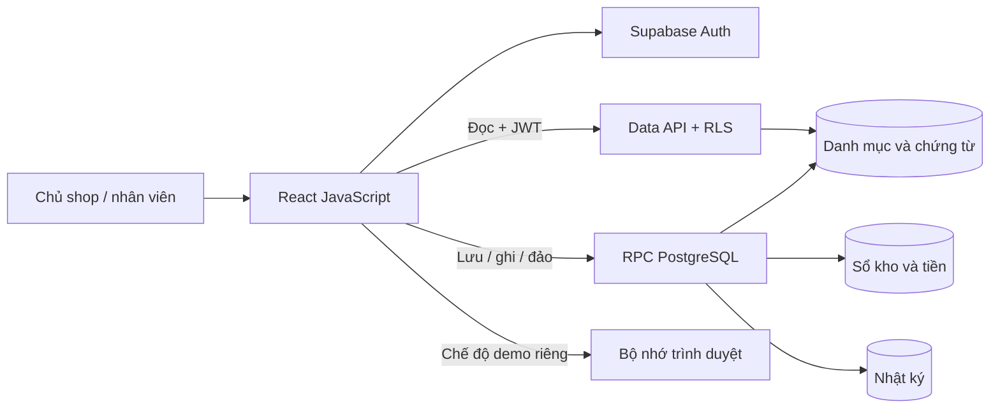

# Kiến trúc ChiDi Online ERP

> Cập nhật 11/09/2026: V1.1 đã thêm bộ chọn workspace, quản lý thành viên có audit/bảo vệ owner cuối cùng, báo cáo server trong cùng snapshot và bảo vệ dữ liệu phiên cũ trả về chậm. Cloud URL/key đã cấu hình và kiểm tra chỉ đọc; migration 002, Auth và nghiệm thu phiên thật còn chờ. Xem [TASKS](../TASKS.md), [thay đổi](CHANGELOG.md) và [vận hành V1.1](THIET_LAP_VAN_HANH_V11.md). Phần dưới giữ phân tích nền và lộ trình toàn bộ ERP; các mô tả giới hạn V1 là mốc thiết kế ban đầu.

Thiết kế và phạm vi bàn giao ngày **10/09/2026**. Công nghệ đã chốt theo yêu cầu: **JavaScript, React JS, Supabase PostgreSQL online**. Tài liệu này phân biệt phần V1 đã có mã chạy được và kiến trúc đích cần phát triển để quản lý toàn bộ doanh nghiệp.

## 1. Quyết định thiết kế

ChiDi nên bắt đầu bằng **một ứng dụng chia rõ phân hệ, dùng một database quan hệ**. React chịu trách nhiệm màn hình và thao tác; Supabase quản lý đăng nhập và PostgreSQL; các lệnh ảnh hưởng sổ kho/sổ tiền chạy trong hàm database có kiểm tra quyền. Thiết kế này giảm số dịch vụ phải chăm sóc mà vẫn có ranh giới nghiệp vụ, chứng từ và dấu vết đủ rõ để mở rộng.

“Chuyên nghiệp như doanh nghiệp lớn” trước hết là biết số liệu đến từ đâu, ai được ghi, ghi khi nào, sửa sai bằng cách nào và khôi phục được khi có sự cố. Không cần bắt đầu với hàng chục microservice, Kubernetes hoặc dashboard nhiều biểu đồ. Những công cụ đó chỉ đáng thêm khi có nhu cầu tải, tổ chức đội ngũ hoặc tích hợp cụ thể.

V1 đã xây là một lát cắt chạy xuyên suốt: **danh mục → chứng từ nháp → kiểm tra → ghi sổ → báo cáo → đảo nếu sai → nhật ký**. Đây là nền vận hành cho nhập hàng và thu chi, chưa thay thế hệ thống kế toán đầy đủ, phần mềm hóa đơn hoặc tất cả hoạt động bán hàng.

## 2. Hiểu hoạt động ChiDi trước khi chọn màn hình

ChiDi kinh doanh thời trang, đặc biệt jeans/shorts, bán qua livestream và kênh online. Luồng định hướng từ nội dung được cung cấp là TikTok/livestream → FLive và Zalo → chốt đơn → vận chuyển SPX/GHN/J&T → giao/hoàn → tiền COD → báo cáo. Khả năng gọi API thực tế của từng nền tảng còn phụ thuộc hợp đồng, tài khoản và tài liệu tích hợp được cấp; không giả định mọi dịch vụ đều có API miễn phí sẵn dùng.

Một chiếc quần có thể xuất hiện trong nhiều khâu, nhưng không vì vậy trở thành nhiều sản phẩm hay nhiều doanh thu. Một khoản chuyển tiền của hãng vận chuyển có thể gom hàng chục đơn; tiền nhận ròng còn bị trừ phí. Tách sản phẩm, đơn hàng, vận đơn, dòng đối soát và giao dịch ngân hàng giúp giải thích chênh lệch thay vì cố ép chúng vào một bảng tổng hợp.

Khai trương **18/08/2026** là mốc kinh doanh người dùng xác nhận. Nó không phải ngày bắt đầu tồn kho bằng 0 hoặc lý do xóa các đợt mua trước khai trương. Hai lần nhập đầu đã được xác nhận là trước tháng 8. Các ngày được chọn random chỉ dùng cho lịch ước tính, phải giữ cờ chưa xác minh.

## 3. Học gì từ thị trường

Đây là so sánh cách tổ chức giải pháp dựa trên tài liệu chính thức, không phải kết quả dùng thử có chấm điểm, chứng minh thị phần hoặc xác nhận toàn bộ tính năng của nhà cung cấp.

| Nhóm tham khảo | Điều có ích cho ChiDi | Quyết định áp dụng |
|---|---|---|
| Haravan / Sapo | Cùng một hành trình đơn hàng, kho, khách và nhiều kênh bán | Một mã đơn nội bộ, ánh xạ mã sàn/vận chuyển, không nhập lại doanh thu mỗi kênh |
| KiotViet | Tập trung thao tác bán lẻ theo ngành | Mã biến thể rõ, form ít bước, tra cứu bằng SKU và mã chứng từ |
| MISA AMIS | Kế toán, đối chiếu và kết nối nghiệp vụ | Tách báo cáo thu chi khỏi báo cáo kế toán, giữ căn cứ chứng từ |
| ERPNext | Phân hệ ERP và cách liên kết chứng từ với sổ | Truy từ số tổng về chứng từ; không sửa sổ trực tiếp bằng màn hình danh mục |
| Odoo | Chia bộ ứng dụng theo phân hệ | Mở rộng từng module theo nhu cầu; kiểm tra riêng giấy phép/tính năng |

Nguồn: [Haravan](https://www.haravan.com/omnichannel), [Sapo](https://www.sapo.vn/omnichannel.html), [KiotViet](https://www.kiotviet.vn/phan-mem-ban-hang-thoi-trang), [MISA AMIS](https://amis.misa.vn/ld/amis-ke-toan), [ERPNext](https://frappe.io/erpnext), [Odoo editions](https://www.odoo.com/page/editions).

ERPNext mã nguồn mở vẫn cần triển khai, hosting và người quản trị. Odoo có Community và Enterprise; không suy diễn mọi chức năng kế toán đều nằm trong bản miễn phí. ChiDi đã chọn tự xây theo nghiệp vụ riêng, nên các sản phẩm này là đối chiếu thiết kế, không phải các thành phần bắt buộc phải mua. [ERPNext pricing](https://frappe.io/erpnext/pricing), [Odoo editions](https://www.odoo.com/page/editions).

## 4. Vì sao chọn database này

| Lựa chọn | Điểm phù hợp | Công việc phải tự làm | Quyết định |
|---|---|---|---|
| Supabase PostgreSQL | Database quan hệ, Auth, API, RLS cùng nền tảng; SDK JavaScript | Thiết kế nghiệp vụ, quyền, backup và kiểm thử | Chọn cho V1 |
| PostgreSQL ở dịch vụ khác như Neon | Quan hệ, giao dịch, SQL; có lựa chọn khởi đầu miễn phí | Bổ sung lớp Auth/API/quyền ứng dụng tương ứng | Phương án thay nơi lưu database khi cần |
| PostgreSQL tự quản | Chủ động cấu hình và di chuyển | Máy chủ, vá lỗi, giám sát, backup, phục hồi, nhân lực | Chưa phù hợp ưu tiên dễ quản lý hiện tại |
| SQLite | Đơn giản cho một thiết bị/công cụ nhỏ | Khó đáp ứng vai trò database online nhiều người ghi cùng lúc | Không dùng làm database chính của ERP online |
| Excel | Người dùng quen, nhập và rà soát nguồn thuận tiện | Khó bảo đảm giao dịch, phân quyền và chống ghi trùng đa người | Giữ làm nguồn chuyển đổi/xuất báo cáo |

PostgreSQL có giấy phép tự do sử dụng theo điều khoản của dự án; điều đó không làm máy chủ, backup hay công sức vận hành tự nhiên miễn phí. [PostgreSQL license](https://www.postgresql.org/about/licence/). SQLite khuyến nghị database client/server khi có nhiều máy truy cập dữ liệu qua mạng hoặc nhiều tiến trình ghi; đây là lý do loại khỏi vai trò database chính. [SQLite use cases](https://www.sqlite.org/whentouse.html). Hạn mức/gói Neon cần đối chiếu lúc lựa chọn, không khóa kiến trúc vào một con số quảng cáo. [Neon pricing](https://neon.com/pricing).

Quyết định dùng Supabase là đánh giá thiết kế cho ChiDi: giảm số hệ thống phải ghép ở giai đoạn đầu, vẫn lưu dữ liệu trong PostgreSQL. Chuyển nhà cung cấp sau này có thể chuyển schema/dữ liệu SQL, nhưng Auth, Storage, RPC exposure và deployment vẫn cần công việc chuyển đổi; không hứa “đổi một URL là xong”.

## 5. Sơ đồ hệ thống

Xem sơ đồ trực quan [architecture.svg](architecture.svg), bản có thể chỉnh sửa [architecture.mmd](architecture.mmd), và [mô hình dữ liệu V1](data-model-v1.mmd). [data-model.mmd](data-model.mmd) là **mô hình đích**, có nhiều bảng chưa tồn tại trong migration V1.



Mũi tên ghi từ React không được hiểu là trình duyệt tự sửa bảng sổ. React gửi yêu cầu; database quyết định người dùng có quyền không, chứng từ có hợp lệ không và có bị ghi trước đó chưa. Một lời gọi RPC thành công mới làm thay đổi đồng thời chứng từ, sổ và nhật ký.

Khi có tích hợp vận chuyển, thêm hàm JavaScript ở máy chủ/Edge Function để giữ API secret và xử lý webhook. Chưa cần dựng một backend Node riêng chỉ để chuyển tiếp mọi truy vấn đang được RLS/RPC xử lý. Nếu quy trình phát triển lớn đến mức SQL trở nên khó quản lý, có thể bổ sung API Node có kiểm soát, nhưng vẫn giữ tính nguyên tử của giao dịch tài chính tại database.

## 6. Ranh giới mã nguồn

React dùng JSX/JavaScript, không chuyển sang TypeScript trái yêu cầu. Vite phục vụ phát triển và tạo bộ file tĩnh. Việc chọn SPA phù hợp ERP nội bộ không cần SEO; routing dạng hash của V1 giúp chạy trên static hosting đơn giản. Đây là quyết định của dự án trong các lựa chọn xây ứng dụng React, không phải yêu cầu duy nhất của React. [React từ đầu](https://react.dev/learn/build-a-react-app-from-scratch), [Vite](https://vite.dev/guide/).

| Lớp | File hiện tại | Trách nhiệm |
|---|---|---|
| Ứng dụng | `src/App.jsx` | Phiên đăng nhập, workspace, điều hướng, trạng thái tải/lỗi |
| Màn hình | `src/pages.jsx`, `src/forms.jsx` | Form, bảng, bộ lọc, xác nhận, CSV |
| Thành phần chung | `src/components.jsx`, `src/styles.css` | Modal, bảng, field, giao diện responsive |
| Quy tắc phía trình duyệt | `src/lib/domain.js` | Kiểm tra sớm, tính tiền, ngày, tổng và CSV an toàn |
| Truy cập dữ liệu | `src/lib/repository.js` | Adapter demo và Supabase dùng cùng thao tác nghiệp vụ |
| Quy tắc có thẩm quyền | `supabase/migrations/001_core.sql` | Quyền, ràng buộc, khóa, ghi sổ nguyên tử |
| Kiểm chứng | `src/lib/domain.test.js`, `scripts/test-database.mjs`, `tests/e2e/` | Số liệu, quyền database và hành trình giao diện |

Khi module tăng, tách `pages.jsx` thành thư mục `features/purchases`, `features/cash`, `features/orders` thay vì tiếp tục phình một file. V1 không thêm abstraction chỉ để tạo nhiều thư mục rỗng. Cần giữ test hợp đồng giữa hai adapter vì demo không thể mô phỏng quyền và đồng thời giống cloud.

## 7. Ba loại dữ liệu phải tách rõ

**Nguồn:** những gì đã đọc từ Excel, gồm mã dòng, SHA-256 file, sheet/dòng nguồn và trạng thái nguồn. Đây là chứng cứ về dữ liệu được nhập, chưa phải chứng cứ giao dịch kinh tế đúng.

**Chứng từ nghiệp vụ:** bản nháp được người có quyền đối chiếu, bổ sung ngày, SKU, tài khoản và căn cứ. Bản nháp thay đổi được; ghi sổ là hành động riêng. Dữ liệu thiếu vẫn tồn tại để xử lý, không bị xóa cho đẹp báo cáo.

**Sổ phát sinh:** kết quả đã ghi qua kiểm tra. Báo cáo dựa trên sổ và ngày nghiệp vụ, có cả phát sinh đảo đúng ngày đảo. V1 có sổ kho nhận hàng và sổ tiền; chưa có sổ cái kế toán kép. Không đọc tổng từ mọi dòng nguồn rồi gọi là tồn kho hoặc lợi nhuận.

Mỗi bảng nghiệp vụ có `workspace_id`. Khóa ngoại gồm cả workspace và ID giúp tránh một phiếu ChiDi trỏ nhầm tới sản phẩm workspace khác dù ai đó biết UUID. Mã SKU và mã nguồn duy nhất trong từng workspace, không nhất thiết duy nhất cho toàn bộ dịch vụ.

## 8. Quy trình nhập hàng

### Đã có ở V1

Một dòng phiếu nhập chứa một SKU, nhà cung cấp, kho, số lượng, đơn giá, phí nhập trực tiếp và ngày nhận. Lưu nháp không tạo kho. Ghi sổ cần ngày thực tế, SKU hết trạng thái tạm, nhà cung cấp/kho hợp lệ. Kết quả là một phát sinh kho với số lượng và tổng tiền chính xác. Phiếu đã ghi không sửa số lượng/đơn giá; chủ shop đảo với ngày và lý do để tạo phát sinh ngược.

V1 dùng một chứng từ cho mỗi dòng hàng để chuyển dữ liệu hiện có an toàn. Một lần nhập nhiều SKU trong nghiệp vụ đích sẽ dùng header phiếu + nhiều dòng; phải có migration rõ và ghi tất cả dòng trong một giao dịch. Phiếu nhập hiện tại chưa phải đơn đặt hàng, hóa đơn mua hay công nợ phải trả.

### Kiến trúc đích

Đề nghị mua → đơn đặt hàng → nhận từng phần → hóa đơn nhà cung cấp → đối chiếu PO/nhận/hóa đơn → thanh toán → phân bổ thanh toán. Các thực thể riêng cho phép nhận hàng trước hóa đơn, hóa đơn trước trả tiền, một khoản trả cho nhiều hóa đơn hoặc trả trước nhà cung cấp.

Ví dụ quản trị giản lược: nhận 10 sản phẩm × 100.000 đ, chưa hóa đơn, giá trị kho tăng 1.000.000 đ và có khoản hàng nhận chưa hóa đơn tương ứng. Khi hóa đơn được chấp nhận, chuyển khoản đó sang công nợ nhà cung cấp. Trả 600.000 đ làm giảm tiền và công nợ 600.000 đ, không tăng kho lần nữa và không ghi toàn bộ 600.000 đ thành giá vốn bán. Chi phí vận chuyển đầu vào phân bổ theo quy tắc cấu hình có chứng từ; không cộng cùng phí ở cả giá nhập và chi phí hoạt động.

Các bút toán ở đây là mô hình quản trị minh họa, chưa xác định tài khoản pháp định, VAT hoặc chính sách thuế của ChiDi. Cần người phụ trách kế toán xác nhận phương pháp trước khi triển khai sổ kế toán chính thức.

## 9. Đơn hàng, kho và COD ở kiến trúc đích

Một đơn nên có trạng thái rõ: nháp, xác nhận, giữ hàng, đóng gói, bàn giao vận chuyển, giao thành công, hủy hoặc hoàn. Trạng thái thanh toán tách khỏi trạng thái giao hàng: giao thành công không có nghĩa hãng vận chuyển đã chuyển tiền về ngân hàng.

Kho cần phân biệt hàng thực có, hàng đã giữ, hàng đang đi và hàng sẵn bán. Khi bàn giao, chuyển từ kho bán sang kho đang giao, không làm biến mất toàn bộ giá trị khỏi hệ thống. Thời điểm ghi doanh thu/giá vốn phụ thuộc chính sách bàn giao quyền kiểm soát được chốt; V1 không tự suy ra từ một trạng thái webhook. Nếu chọn ghi khi giao thành công, phát sinh phải nối về sự kiện đã xác minh và đơn gốc.

Ví dụ bỏ qua thuế để giải thích: đơn bán 300.000 đ, giá vốn 180.000 đ, phí vận chuyển/thu hộ shop chịu 25.000 đ. Khi đáp ứng điều kiện ghi nhận, doanh thu 300.000 đ, giá vốn 180.000 đ, khoản cần thu qua hãng vận chuyển 300.000 đ. Khi hãng chuyển 275.000 đ và chứng minh phí 25.000 đ, đối soát xóa khoản phải thu 300.000 đ bằng ngân hàng 275.000 đ cộng phí 25.000 đ. **Khoản 275.000 đ không tạo thêm 275.000 đ doanh thu.** Nếu shop/khách chịu phí khác, số liệu phải theo hợp đồng và bảng đối soát thực tế.

Hệ thống đích cần `shipments`, `cod_settlements`, `cod_settlement_lines`, `bank_transactions`, `settlement_matches`. Một dòng đối soát có thể khớp một vận đơn; mọi phần chênh lệch đều có trạng thái/lý do. Khớp tự động chỉ khi đủ khóa tin cậy và số tiền; không dùng gần giống tên khách để tự ghi sổ.

Hoàn một phần phải tham chiếu dòng bán gốc, số lượng đã giao và giá vốn gốc. Hàng còn bán được vào kho phù hợp; hàng lỗi vào kho chờ xử lý. Hoàn tiền và hoàn hàng là hai luồng riêng. Bán/giao lại một hàng hoàn cần nhận diện nghiệp vụ mới, không sửa lịch sử đơn đầu cho khớp số hiện tại.

## 10. Giá vốn, thu chi và kế toán

V1 giữ giá trị mua của từng phiếu nhận, chưa có FIFO cho xuất bán. Kiến trúc đích có lô giá vốn và bảng phân bổ từ dòng bán sang lô. Ví dụ lô A 5 chiếc × 80.000 đ, lô B 5 chiếc × 90.000 đ, bán 7 chiếc theo FIFO thì giá vốn 580.000 đ, còn 3 chiếc trị giá 270.000 đ. Hoàn 2 chiếc phải truy được phần phân bổ gốc và quy tắc hoàn, không tùy tiện lấy giá mua mới nhất.

Tiền trong V1 lưu VND nguyên bằng `bigint`; số lượng là đơn vị sản phẩm nguyên. Mỗi giá trị tiền giới hạn 9.000.000.000.000 đ. JavaScript kiểm tra số nguyên và cộng bằng BigInt rồi chỉ chuyển ra Number nếu an toàn. Nếu chuyển sang hàng cân, ngoại tệ, giá phân bổ lẻ hoặc thuế, dùng `numeric(p,s)` và truyền chuỗi decimal, bổ sung thư viện decimal cùng quy tắc làm tròn; không dùng float để làm tròn “gần đúng”.

Hệ thống kế toán đích cần danh mục tài khoản, kỳ kế toán, journal header/lines, loại chứng từ, mapping nghiệp vụ và đối tượng công nợ. Tổng Nợ = tổng Có cho từng chứng từ phải được đảm bảo ở cấp giao dịch; không chỉ kiểm tra ở React. Sổ phát sinh không sửa/xóa qua ứng dụng. Đảo và điều chỉnh có tham chiếu bản gốc, người thực hiện, căn cứ và kỳ cho phép.

ERPNext là tham khảo cho việc truy từ sổ cái về chứng từ đã submit; perpetual inventory liên kết thay đổi giá trị kho với hạch toán. ChiDi cần thiết kế quy tắc của mình và kiểm thử từng luồng trước khi gắn nhãn “kế toán”. [ERPNext General Ledger](https://docs.frappe.io/erpnext/general-ledger), [Perpetual inventory](https://docs.frappe.io/erpnext/perpetual-inventory).

Chi tiền mua hàng, chủ shop rút tiền, góp vốn, nhận COD và trả lương không tự tương đương chi phí/doanh thu kỳ. FLive có thể là tiền dịch vụ cho nhiều kỳ, bao bì có thể tiêu dùng ngay hoặc cần theo dõi tồn; cách ghi nhận phải dựa trên kỳ dịch vụ và chính sách. Do đó V1 gọi báo cáo là **thu chi đã ghi**, không gọi số dư tiền là lợi nhuận và không tự dựng P&L chưa đủ dữ liệu.

## 11. Chống trùng, đồng thời và sửa sai

Khi ghi sổ, RPC khóa dòng chứng từ, kiểm tra trạng thái, ghi ledger, đổi trạng thái và thêm nhật ký trong một giao dịch. Unique constraint trên chứng từ + loại phát sinh là lớp bảo vệ thứ hai. Một request ID không được tái sử dụng cho nghiệp vụ khác; chứng từ đã ghi trả về kết quả hiện có. Nếu mạng mất sau khi server đã commit, gửi lại không tạo dòng sổ thứ hai.

PostgreSQL có khóa dòng và khóa giao dịch phù hợp bảo vệ tài nguyên được cập nhật đồng thời. Khóa phải lấy theo thứ tự nhất quán khi mở rộng nhiều SKU để giảm deadlock. [PostgreSQL locking](https://www.postgresql.org/docs/current/explicit-locking.html). PGlite đã kiểm tra replay và quyền nhưng không chứng minh thử tải nhiều kết nối thực; cần test cạnh tranh trên PostgreSQL/Supabase thử nghiệm trước mở rộng bán hàng giữ tồn.

Chứng từ đảo giữ nguyên số liệu nguồn, thêm phát sinh ngược và lý do. Báo cáo tới trước ngày đảo vẫn thấy phát sinh gốc; báo cáo sau ngày đảo thấy ảnh hưởng ròng. V1 chưa có khóa kỳ kế toán, nên quyền owner phải dùng có kiểm soát; giai đoạn kế toán bổ sung kỳ đóng/mở, phân tách người lập và người duyệt, hạn mức duyệt và nhật ký mở lại kỳ.

Đối với tích hợp, sự kiện cần gửi được ghi vào outbox cùng giao dịch nghiệp vụ. Worker gửi sau, retry có backoff, lưu lần thử và khóa chống trùng ở hệ thống nhận. Không hứa giao sự kiện “đúng một lần” qua mạng; thiết kế để việc nhận lặp không gây hiệu ứng lặp. [Transactional outbox](https://docs.aws.amazon.com/en_en/prescriptive-guidance/latest/cloud-design-patterns/transactional-outbox.html). Outbox và worker chưa triển khai trong V1.

## 12. Phân quyền và bảo vệ dữ liệu

| Vai trò V1 | Đọc | Tạo/sửa nháp | Danh mục thường | Ghi sổ | Số dư đầu / nhập nguồn / đảo |
|---|---|---|---|---|---|
| owner | Có | Có | Có | Có | Có |
| manager | Có | Có | Có | Có | Không |
| staff | Có | Có | Không | Không | Không |
| viewer | Có | Không | Không | Không | Không |

Quyền V1 còn ở cấp workspace, chưa tách nhân viên kho khỏi dữ liệu tiền theo phân hệ. Trước khi đưa dữ liệu lương hoặc thông tin nhạy cảm, bổ sung quyền theo module/chức năng và kiểm thử bảng liên quan. Bản demo chỉ là trải nghiệm một người, không phải kiểm chứng quyền.

RLS lọc dữ liệu theo workspace; RPC kiểm tra lại role bên server. Các hàm đặc quyền dùng `search_path` rỗng, tên bảng được ghi đầy đủ và quyền execute giới hạn. Secret/API key của nhà vận chuyển không nằm trong `VITE_*`. Backup và log phải tránh chứa token/mật khẩu. Tệp đính kèm ở giai đoạn sau dùng bucket riêng tư và đường dẫn theo workspace, tải qua URL có thời hạn; chưa bật bucket công khai trong V1.

OWASP ASVS cung cấp tập yêu cầu để lập kế hoạch kiểm chứng Auth, quyền, đầu vào, phiên và log. Dự án không tự nhận đạt chứng nhận ASVS chỉ vì có vài test quyền. [OWASP ASVS](https://owasp.org/www-project-application-security-verification-standard/).

## 13. Dữ liệu Excel đã được nghiên cứu

Nguồn hiện tại là `ChiDi_Online_Business_ERP.xlsx` trong thư mục ERP cũ. Snapshot ngày 10/09/2026 đọc dữ liệu đầu vào, không ghi workbook. SHA-256:

```text
b85f3d515d392c38ca0a451717cd8eb2dd35f47a2e0cb0219b6fbe1cbe6785a4
```

| Chỉ tiêu | Báo cáo chuyển đổi trước đây | File hiện tại đọc lại |
|---|---:|---:|
| Dòng nhập hàng | 15 | 17 |
| Số lượng đầu vào | 1.463 | 1.566 |
| Tiền hàng đầu vào | 74.318.000 đ | 79.043.000 đ |
| SKU tạm/danh mục nguồn | 15 | 17 |
| Nhà cung cấp hiện tại | — | 3 |
| Dòng thu chi hiện tại | — | 12 |
| Đơn bán đọc được | — | 0 |

Hai dòng mới `POL-LEG-L9-001` và `POL-LEG-L10-001` ngày 09/09/2026 có 100 × 45.000 đ và 3 × 75.000 đ. Nguồn đánh dấu đã ghi “Có”, nhưng dấu đó chưa đủ bằng chứng để tự ghi sổ trong website mới. Cả 17 dòng vào khu vực nháp; trạng thái gốc vẫn được giữ. Không ghi đè dữ liệu mới bằng bản 15 dòng cũ chỉ để khớp báo cáo tháng 8.

12 dòng thu chi hiện tại có tổng chiều thu 10.139.000 đ và chiều chi 14.978.000 đ; đây là tổng dữ liệu nguồn chưa đối chiếu đủ. File cũ từng có các khoản mua hàng xuất hiện ở hai bảng, cần nhận diện là cùng sự kiện thanh toán. Các khoản chi không rõ tài khoản theo câu trả lời người dùng vẫn để trống tài khoản. Không tự phân bổ vào tiền mặt để làm đẹp số dư.

Lịch ước tính đã dùng: 21/07 đợt 1, 28/07 đợt 2, 04/08 đợt 3–4, 11/08 đợt 5, 18/08 đợt 6, 25/08 đợt 7–8. Cách gộp này đáp ứng lịch tuần để lập kế hoạch, không chứng minh từng nhóm hàng thực nhận trong cùng ngày. Dữ liệu tháng 9 vừa thêm giữ ngày nguồn riêng; không kéo về lịch tháng 8.

## 14. Quy trình chuyển dữ liệu

Script đọc file dưới dạng snapshot bytes, tính SHA-256 rồi xuất JSON riêng. ID nguồn ổn định được dùng chống trùng; hash file dùng nhận diện lần nhập. Nếu file đổi một ô, hash file đổi nhưng các dòng cũ không vì vậy được tạo lần hai. Dòng nguồn cùng ID nhưng nội dung khác trở thành xung đột cần xem, không tự sửa chứng từ đã có.

Các bước nghiệm thu: lưu nguồn → đối chiếu số dòng/tổng → rà SKU và NCC → kiểm ngày → kiểm tài khoản/số dư → kiểm số tiền trùng → nhập nháp → đối chiếu lại → ghi từng chứng từ có căn cứ. Những mục chưa rõ vẫn sống trong hàng chờ. Phân loại đề xuất như FLive sang phần mềm được ghi chú để người dùng xem lại, không coi là chính sách kế toán đã được chấp thuận.

Nếu workbook có dữ liệu mới, chạy script ra **một tên file mới**; script từ chối ghi đè file xuất đang tồn tại. Không mở workbook bằng chế độ ghi để chỉ lấy dữ liệu. Xuất lại không kiểm chứng công thức Excel hoặc hợp pháp hóa giao dịch; việc phân tích input và việc kiểm tra tài chính là hai bước cần phối hợp.

## 15. Báo cáo nào dùng được ngay

Dashboard V1 chỉ tính kho nhận từ ledger, dòng tiền trong kỳ, số chứng từ chờ và giá trị nháp cần đối chiếu. Trang kho tổng hợp nhận/đảo theo SKU tới ngày chọn; chưa bao gồm xuất bán nên chưa phải kiểm kê tồn thực tế. Báo cáo tiền dùng số dư đầu đã xác nhận cộng phát sinh tới ngày xem, có xử lý đảo và ngày trước mở sổ.

Dữ liệu đọc cloud có phân trang để tránh giới hạn mặc định làm cắt báo cáo còn 1.000 dòng. Tuy vậy V1 tải nhiều bảng về trình duyệt và không có snapshot nhất quán xuyên mọi request. Khi nhiều người cập nhật cùng lúc, cần làm báo cáo server dùng một snapshot/giao dịch và phân trang đúng nguồn. Trước khi dữ liệu vượt 100.000 dòng mỗi bảng, chuyển các màn hình sang API phân trang và truy vấn tổng hợp; V1 chủ động báo vượt giới hạn thay vì âm thầm thiếu dòng.

P&L, bảng cân đối, công nợ, tuổi nợ, hiệu quả livestream, lãi theo SKU/kênh và tồn khả dụng chỉ được đưa ra sau khi module nguồn tương ứng đầy đủ. Mọi KPI phải có định nghĩa, kỳ, múi giờ, trạng thái được tính và đường đi về dòng chứng từ. Không dùng giá trị demo để lấp biểu đồ của workspace thật.

## 16. Vận hành và chi phí

Supabase Free phù hợp để xây, thử và khởi đầu trong hạn mức; cần xem [giá hiện hành](https://supabase.com/pricing) và phần hạn mức trong [hướng dẫn Supabase](SUPABASE_SETUP.md). Không cam kết toàn bộ ERP doanh nghiệp vận hành miễn phí vĩnh viễn. Chi phí tăng còn có tên miền, gửi mail, lưu tệp, API đối tác, backup, phát triển và hỗ trợ.

Website là static bundle nên có nhiều lựa chọn hosting. Chỉ xuất bản `dist/`, không upload toàn project kèm `data/`, `.env.local`, Excel hay `.tools/`. Trước xuất bản phải cấu hình domain HTTPS, Auth redirect, CSP phù hợp Supabase, quota và quy trình rollback. Hiện chưa có website công khai được triển khai.

Sao lưu hằng ngày ngoài hệ thống cùng kiểm tra khôi phục là mức thiết kế khởi đầu. Nếu cần mất tối đa 15 phút dữ liệu, phải triển khai/kiểm chứng cơ chế tương ứng như PITR/WAL và gói phù hợp; không gọi một lịch backup ngày là RPO 15 phút. Đặt mục tiêu phục hồi theo buổi diễn tập thực tế, ghi thời gian và kiểm tổng. [PostgreSQL backup](https://www.postgresql.org/docs/current/backup.html).

## 17. Lộ trình để thành ERP đầy đủ

| Giai đoạn | Kết quả cần có | Điều kiện qua cổng |
|---|---|---|
| V1 hiện tại | React, danh mục, nhập hàng, thu chi, import, ledger, audit, SQL/RLS | Test máy đạt; cấu hình và nghiệm thu cloud còn chờ |
| V1.1 vận hành nhóm | Mời thành viên, chọn workspace, quyền theo module, báo cáo server, backup đã khôi phục | Kiểm thử 2 tài khoản/API và tải đồng thời thật |
| V2 bán hàng và kho | Khách, đơn/chi tiết, giữ tồn, giao hàng, xuất/hoàn, kiểm kê, FIFO | Không âm tồn trái chính sách, partial flows, giá vốn truy nguyên |
| V3 COD và công nợ | Nhập file đối soát, ghép vận đơn, phí/thiếu/thừa, AP/AR, phân bổ tiền | Không tính COD hai lần; đối soát từng phần và không khớp có xử lý |
| V4 kế toán quản trị | Sổ kép, kỳ, khóa kỳ, opening migration, P&L, bảng cân đối, dòng tiền | Tổng Nợ/Có cân, subledger = GL, kiểm chứng bởi người phụ trách kế toán |
| V5 mở rộng | Livestream/CRM/marketing, lương, tài sản, tích hợp được cấp API | Kiểm quyền nhạy cảm, phân bổ theo kỳ, sự kiện retry an toàn |

Không đặt lịch giao chính xác khi chưa biết số người phát triển, giờ dành cho dự án, hợp đồng API và độ sạch dữ liệu. Mỗi giai đoạn nên giao một luồng hoàn chỉnh có test và hướng dẫn. [Prompt triển khai](PROMPT_XAY_DUNG_ERP_CHIDI.md) quy định đầu ra và tiêu chí cụ thể để tiếp tục mà không làm mất phần đã có.

## 18. Giới hạn bằng chứng và quyết định còn mở

Chưa có thông tin pháp nhân, chính sách kế toán/thuế, phí hợp đồng vận chuyển, chuẩn SKU thật, số dư tiền/kho đầu đầy đủ và tài khoản Supabase. Những thiếu hụt này không ngăn xây app và kiểm thử kỹ thuật, nhưng ngăn khẳng định số liệu kế toán đã đúng hoặc hệ thống sẵn sàng thay sổ chính.

Các số snapshot trong tài liệu là quan sát file ngày kiểm tra; không phải xác nhận đã thanh toán hoặc hàng vẫn còn tại kho. Test đạt chứng minh hành vi trong kịch bản đã chạy, không bao phủ mọi lỗi và không thay kiểm toán. Nguồn nghiên cứu cùng nhận định thiết kế được tập hợp ở [RESEARCH_SOURCES.md](RESEARCH_SOURCES.md); kết quả kỹ thuật thực tế ở [VERIFICATION.md](VERIFICATION.md).
