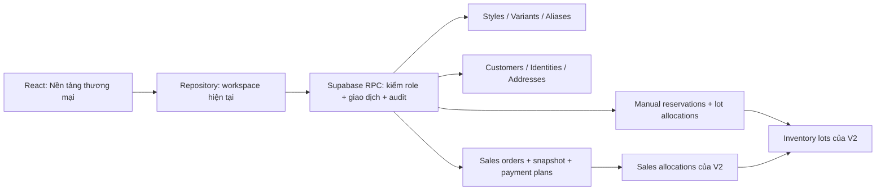

# Phase B — nền tảng thương mại ChiDi

Cập nhật 17/09/2026. Phạm vi theo yêu cầu mới nhất: hoàn thiện nền SKU, khách hàng, địa chỉ, giữ tồn và khung thanh toán trên V2 hiện có. Không thay ID sản phẩm, không nhập lại Excel, không sửa migration 001/002/003. Kết quả chạy thử được ghi riêng tại [verification Phase B](verification/PHASE_B_VERIFICATION.md); trạng thái local không thay thế nghiệm thu Supabase thật.

## Những gì đã xây dựng

| Phần | Kết quả | Giữ tương thích |
|---|---|---|
| Kiểu dáng / biến thể | `product_styles`, `product_variants`; một biến thể tương thích cho mỗi SKU | `products` vẫn là SKU, `variant.id = product.id`; chứng từ giữ nguyên khóa |
| Alias | `product_aliases`; RPC tra cứu mã SKU và alias chính xác | Trùng giữa nhiều SKU trả `ambiguous`; không tự chọn hoặc tạo đơn |
| Khách hàng | Giữ `customers` và màn hình Khách hàng; thêm identities/addresses | Không tự gộp khách theo tên, số điện thoại cũ hoặc nickname |
| Địa chỉ đơn | Chọn địa chỉ đúng khách cho đơn nháp; chụp dữ liệu lúc xác nhận | Đơn đã xác nhận không đổi theo thông tin khách sửa sau này |
| Giữ hàng | `inventory_reservations` + `reservation_lots`; tạo, giải phóng, chuyển sang đơn | Dùng cùng lots, workspace lock và FIFO của V2; không tạo sổ kho mới |
| Kế hoạch thanh toán | `payment_intents`, trạng thái `planned`/`void` | Không đồng nghĩa đã thanh toán, không ghi cash/GL/doanh thu |
| Giao diện | Menu **Nền tảng thương mại**, năm nhóm nghiệp vụ | Lazy load, quyền theo workspace, báo lỗi migration rõ ràng; demo cũ giữ nguyên |

Các tên loại định danh TikTok LIVE/Shop/Zalo chỉ là nhãn lưu ID thủ công. Chưa có kết nối mạng xã hội, parser, ticket, cart, CHỐT & IN, in ấn, shipping API hoặc đối soát COD.

## Kiến trúc thực thi



Browser không ghi trực tiếp bảng mới. Tám bảng public bật RLS với membership theo workspace; authenticated chỉ SELECT trực tiếp, anonymous không được đọc. FK kép gồm workspace ngăn liên kết chéo shop. RPC ghi kiểm owner/manager, lấy actor từ `auth.uid()`, dùng helper private và audit. Riêng `set_order_address` cho phép thêm staff trên đơn nháp. Viewer chỉ đọc. Khóa workspace được dùng chung với nghiệp vụ kho cũ.

`get_catalog_state`, `get_customer_foundation`, `get_inventory_foundation` và `get_sales_state` là các lần đọc riêng; trang tổng hợp không cam kết snapshot toàn bộ bốn RPC cùng một thời điểm. Mọi kiểm tra số lượng khi ghi vẫn do transaction trên server quyết định. Các endpoint mới báo lỗi rõ khi vượt giới hạn 50.000 dòng mỗi nhóm, không âm thầm cắt dữ liệu; cần phân trang trước khi mở rộng quy mô đó.

## Chạy nâng cấp trên Supabase đã có V2

1. Giữ một bản backup có thể khôi phục và chọn thời điểm dừng ghi nghiệp vụ trong lúc nâng cấp. Bản drill backup/restore thật chưa được xác nhận bởi các test local.
2. Xác nhận migration 003 đã **hoàn tất**: có `inventory_lots`, `sales_allocations`, `sales_orders`, `transition_sales_order` và luồng bán V2 đang hoạt động. Không chạy lại 001/002/003. Nếu 003 từng lỗi `55006`, dừng đường nâng cấp này và xử lý blocker [A1](verification/V2_BASELINE_VERIFICATION.md); 004 không sửa một 003 chưa chạy thành công.
3. SQL Editor → New query → chạy **toàn bộ** [004_catalog_variants_aliases.sql](../supabase/migrations/004_catalog_variants_aliases.sql) một lần. Đợi thành công; không chỉ chạy vùng đang bôi chọn.
4. Chạy toàn bộ [005_customer_order_foundation.sql](../supabase/migrations/005_customer_order_foundation.sql) một lần.
5. Chạy toàn bộ [006_inventory_reservations.sql](../supabase/migrations/006_inventory_reservations.sql) một lần. File có `BEGIN`/`COMMIT`; không bỏ phần thay thế hai RPC ở cuối file.
6. Chạy script chỉ đọc [verify_phase_b.sql](../supabase/verification/verify_phase_b.sql). Kết quả là một ô JSON metadata và số đối chiếu tổng hợp, không chứa tên khách, địa chỉ hoặc token.
7. Kiểm kết quả: 8 bảng, RLS bật, SELECT authenticated có, ghi trực tiếp/anonymous không có; 15 RPC mới có SECURITY DEFINER/search_path rỗng, chỉ authenticated được execute. Ba chỉ số `products_without_compatible_variant`, `negative_available_lots`, `manual_hold_allocation_mismatch` phải bằng **0**. `products = variants`; số cần đối chiếu và đơn cũ thiếu snapshot có thể khác 0 bình thường.
8. Mở **START_CHIDI.cmd**, đăng nhập tài khoản hiện có, chọn workspace, mở **Nền tảng thương mại** và Tải lại. Không cần thêm secret/service-role key. Nếu báo thiếu RPC, đối chiếu tên migration trong thông báo và trạng thái SQL Editor; không đổi sang demo để che lỗi cloud.
9. Trong workspace thử, thực hiện kịch bản nghiệm thu dưới đây trước khi nhập thêm thông tin thật. Nếu 004/005/006 đã chạy thành công, không chạy lại: lưu kết quả verification và dùng giao diện.

Các file migration có transaction nhưng không thiết kế để chạy lặp sau khi đã thành công. Lỗi ở một file làm rollback file đó; giữ kết quả các file trước đã thành công. Không sửa file lịch sử để khớp một deployment khác biệt; đối chiếu metadata rồi tạo migration tiếp theo nếu cần sửa.

## Cách vận hành

### SKU, kiểu dáng và alias

Vào Danh mục để tạo SKU như trước. Mỗi SKU mới tự có biến thể tương thích; dữ liệu cũ được backfill với kiểu dáng/cỡ/màu chưa rõ và trạng thái `needs_review`. Không suy diễn màu hoặc nhóm từ tên hàng. SKU tạm phải được xác minh trước khi xác nhận ánh xạ biến thể.

Trong **SKU & biến thể**, thêm kiểu dáng rồi Đối chiếu từng SKU. Ghi căn cứ, chọn nhóm và chỉ điền thuộc tính biết chắc. Ràng buộc trên database chặn hai biến thể đã xác nhận cùng kiểu dáng/cỡ/màu sau chuẩn hóa. Không gộp, xóa hay đổi nghĩa SKU cũ chỉ để vượt ràng buộc.

Trong **Alias**, thêm tên gọi thay thế cho đúng SKU. Chuẩn hóa dùng Unicode NFC, chữ thường, bỏ khoảng trắng thừa; giữ dấu và dấu câu, không dò gần đúng. Cùng alias/cùng SKU không được tạo hai lần kể cả một dòng đang ngừng dùng. Cùng alias ở hai SKU khác nhau được lưu nhưng tra cứu báo mơ hồ. Mã SKU gốc cũng tham gia tra cứu: va chạm alias với mã SKU khác phải được xử lý, không ưu tiên ngầm một bên. Một kết quả chưa đối chiếu trả `needs_review`.

### Khách, định danh và địa chỉ

Tạo khách tại **Khách hàng**. Sau đó vào **Hồ sơ khách** để liên kết ID ổn định của đúng người. PHONE yêu cầu E.164 có mã quốc gia (ví dụ `+84901234567`); không tự suy đoán quốc gia. EMAIL chuẩn hóa chữ thường; ID nền tảng giữ phân biệt hoa/thường. Mỗi định danh chuẩn hóa chỉ thuộc một khách trong cùng workspace. Không tự merge lịch sử.

Đánh dấu đã xác minh cần ghi căn cứ ít nhất 10 ký tự; đây là xác minh thủ công, không phải OTP từ nhà cung cấp. Mỗi khách tối đa một địa chỉ mặc định. Địa chỉ mặc định không tự gán cho mọi đơn; chọn rõ ở bảng **Địa chỉ đơn nháp**. Nhân viên có quyền chọn địa chỉ cùng khách, không có quyền sửa định danh/địa chỉ gốc.

Khi xác nhận đơn bằng nghiệp vụ V2 hoặc chuyển lượt giữ, trigger lưu tên/liên hệ/địa chỉ, nguồn, actor và thời điểm trong `customer_snapshot`. Không chọn địa chỉ sẽ dùng liên hệ cũ với nhãn **chưa xác minh**. Đơn đã xác nhận trước 005 giữ snapshot NULL và `legacy_unavailable`; không lấy địa chỉ hiện tại làm địa chỉ lịch sử. Xem bản chụp trong chi tiết **Bán hàng**.

### Giữ hàng và chuyển sang đơn

`Có thể bán = tồn vật lý trong lots − sales allocations đang reserved − lượt giữ thủ công active`.

Tạo lượt giữ với SKU đã xác nhận, kho, số lượng nguyên và ngày thực tế không vượt hôm nay tại Việt Nam. Chỉ các lô sẵn có đúng ngày được sử dụng. Giữ hàng không giảm tồn vật lý hoặc tạo doanh thu. Luồng xác nhận đơn cũ cũng trừ hàng đang giữ thủ công; đảo phiếu nhập bị chặn khi lô còn phần giữ.

Lượt giữ không tự hết hạn; quản lý giải phóng toàn bộ khi hết nhu cầu. Muốn bán phần đã giữ: tạo **đơn nháp** ở Bán hàng rồi **Chuyển sang đơn**, chọn các lượt giữ khớp đúng kho, mọi SKU và tổng số lượng toàn đơn. Giao dịch thành công chuyển lượt giữ thành `consumed` và xác nhận đơn; thất bại rollback tất cả. Việc này chuyển cam kết số lượng, không cam kết giữ nguyên ID lô: FIFO được tính lại trong cùng khóa workspace. Không giữ hai lần. Hủy đơn sau đó giải phóng sales allocations; không tự kích hoạt lại lượt giữ thủ công.

Reserve/release/transfer có request UUID và so payload trên server. Nút lưu chống nhấp lặp, retry cùng dữ liệu trong hộp thoại giữ cùng UUID. Reload/đóng rồi tạo lại là yêu cầu mới: sau lỗi mạng chưa biết kết quả, Tải lại và đối chiếu trước khi tạo lại. Các form tạo mới kiểu dáng/địa chỉ/kế hoạch chưa có cơ chế replay chung; đặc biệt không bấm tạo lại kế hoạch thanh toán chỉ vì phản hồi bị mất.

### Kế hoạch thanh toán

Chọn đơn, loại đặt cọc/thanh toán/hoàn tiền, số nguyên VND và phương thức dự kiến. Có thể sửa khi `planned`, hủy với lý do thành `void`; không hard-delete. Bảng này không chứng minh khách đã trả, không tạo chứng từ tiền, không đánh dấu COD đã đối soát, không tự trừ số phải thu. Chứng từ thu/chi thực tế vẫn dùng quy trình hiện tại; chưa có tự động liên kết/khấu trừ giữa hai phần.

## Nghiệm thu cloud bằng dữ liệu thử

| Kịch bản | Kết quả cần đạt |
|---|---|
| Tài khoản A không có membership workspace B | Không đọc/ghi dữ liệu B qua UI, RPC hoặc bảng mới |
| Viewer mở năm tab; staff chọn địa chỉ đơn nháp | Viewer chỉ xem; staff không thêm định danh, giữ hàng hoặc kế hoạch |
| Tạo alias dùng chung hai SKU | Tra cứu báo nhiều ứng viên, không tạo đơn |
| Xác nhận đơn có địa chỉ rồi sửa khách/địa chỉ gốc | Chi tiết đơn vẫn hiển thị bản chụp cũ |
| Kho 10, giữ 3, xác nhận đơn 8 | Bị từ chối; đơn 7 được phép, không bán vượt tồn |
| Chuyển đủ lượt giữ vào đơn nháp | Một đơn confirmed, lượt giữ consumed, không nhân đôi phần giữ |
| Gửi lại cùng request UUID/payload | Cùng kết quả, không thêm audit/giữ lần hai; đổi payload bị chặn |
| Tạo/hủy kế hoạch thanh toán | Sổ tiền và doanh thu không đổi |

Không dùng thử trên phiếu thật bằng thao tác giả. Lưu bằng chứng đã che thông tin riêng: thời điểm, workspace thử, vai trò, kết quả; không ghi JWT/mật khẩu/key vào tài liệu.

## Kiểm thử và khôi phục

Chạy trong thư mục project với Node đã có trong `.tools` trên PATH:

```powershell
npm run test:foundation
npm run test:concurrency
npm run test:cloud-ui
npm run check
npm run test:e2e
npm run test:builds
```

Chi tiết phạm vi và kết quả: **223 kiểm tra PASS local** trong [verification](verification/PHASE_B_VERIFICATION.md). Các suite PGlite tạo database tạm; Playwright dùng API giả tại port 5201. `test:concurrency` dùng PostgreSQL native đã cài, mặc định `C:\Program Files\PostgreSQL\14\bin`; có thể đặt `CHIDI_PG_BIN` tới thư mục binaries khác. Lệnh chỉ tạo cluster thử riêng và dừng cluster do chính nó tạo; cần có initdb/pg_ctl/psql và không dùng URL database hiện có. Không tự chạy DDL hoặc gửi dữ liệu lên Supabase thật.

Rollback trước commit là rollback transaction. Sau khi đã có dữ liệu Phase B, ưu tiên ngừng các thao tác mới và sửa tiến bằng migration mới. Không DROP bảng giữ hàng, không chép đè RPC cũ 003 khi còn manual holds: thao tác đó có thể làm bán vượt tồn. Không chạy lại 001/002/003 hoặc restore đè lên giao dịch phát sinh sau backup. Nếu cần restore, diễn tập vào database riêng và đối chiếu trước.

Các tồn đọng A1/A2/A3/A5/A11 được giữ trong [migration plan](architecture/V2_MIGRATION_PLAN.md). Không tự coi cloud/Auth, mọi quy tắc ngày của V2 cũ, hoặc backup thật đã PASS từ kiểm thử Phase B.
