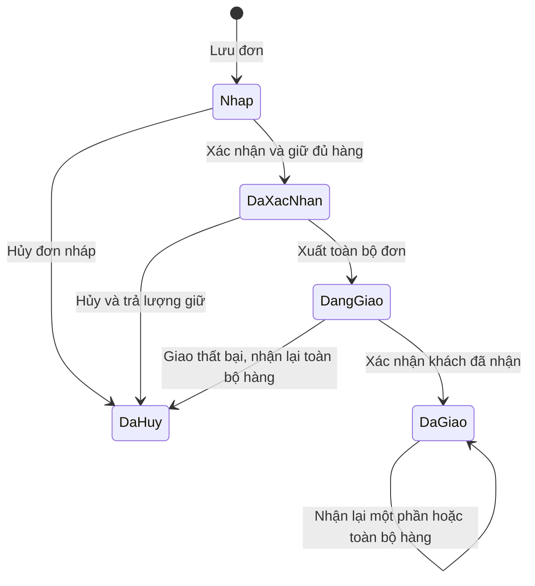

# Quy tắc bán hàng, giữ hàng và giá vốn ChiDi V2

Cập nhật: **12/09/2026**. Đây là quy tắc nghiệp vụ và tiêu chí nghiệm thu cho bản bán hàng V2. Mã database nằm trong [003_sales_inventory.sql](../supabase/migrations/003_sales_inventory.sql); [hướng dẫn nâng cấp và bài thử](THIET_LAP_V2.md) trình bày cách sử dụng. Các kết quả chưa có bằng chứng được ghi “chờ kiểm tra”, không lấy số test của V1/V1.1 làm kết quả V2.

## 1. Phạm vi của phiên bản

V2 nối khách hàng, đơn bán nhiều dòng, giữ hàng, xuất hàng theo FIFO, giao thành công và hàng hoàn với sổ kho. Một đơn được xuất **toàn bộ trong một lần**. Khách có thể trả một phần hàng sau khi giao thành công. Nếu giao thất bại khi hàng vẫn đang đi, xử lý hoàn toàn bộ kiện hàng còn lại sau khi đã nhận lại và kiểm đếm.

Chia một đơn thành nhiều lần xuất, nhiều kiện, đổi hàng bù trừ tự động, kho hàng lỗi/cách ly, đối soát COD tự động, công nợ hóa đơn, sổ cái kép và thuế chưa thuộc phạm vi hoàn thiện của V2. Những nghiệp vụ này cần chứng từ và kiểm tra riêng; không mô phỏng bằng cách sửa trạng thái đơn tùy ý.

## 2. Nghiên cứu được áp dụng như thế nào

ERPNext mô tả giữ hàng là dành số lượng cho một đơn và có nghiệp vụ bỏ giữ. ChiDi áp dụng sự tách biệt giữa giữ hàng và hàng thực tế ra khỏi kho. [ERPNext Stock Reservation](https://docs.frappe.io/erpnext/stock-reservation).

ERPNext dùng chứng từ giao hàng để ghi sự dịch chuyển hàng khỏi kho. ChiDi chọn bước **Xuất giao hàng** làm thời điểm giảm kho; bước xác nhận đơn chỉ giữ hàng. [ERPNext Delivery Note](https://docs.frappe.io/erpnext/delivery-note).

ERPNext hướng dẫn tạo hàng trả dựa trên giao dịch gốc và tránh nhận lại cùng lượng hàng hai lần. ChiDi lưu liên kết đến từng phân bổ giá vốn đã xuất để kiểm tra lượng trả và phục hồi giá trị. [ERPNext Sales Return](https://docs.frappe.io/erpnext/sales-return).

Các quy ước một lần xuất, thứ tự phân bổ khi trả và điểm ghi doanh thu quản trị dưới đây do dự án ChiDi lựa chọn cho phiên bản này. Chúng không phải tuyên bố mọi ERP đều áp dụng cùng cách.

## 3. Vòng đời đơn hàng



| Bước | Điều kiện chính | Tác động |
|---|---|---|
| Lưu nháp — `draft` | Người dùng có quyền nhập liệu; dữ liệu đúng định dạng | Lưu khách hàng và các dòng đặt; chưa giữ hàng, chưa xuất kho |
| Xác nhận — `confirmed` | SKU đã xác nhận; đủ lượng có thể giữ trong kho/ngày nghiệp vụ | Giữ toàn bộ số lượng đơn; lượng trong kho chưa giảm |
| Xuất giao — `shipped` | Đơn đã xác nhận; các phần giữ vẫn hợp lệ | Xuất toàn đơn từ các lô đã giữ, lưu giá vốn; hàng chuyển sang đang giao |
| Giao thành công — `delivered` | Đơn đang giao; ngày không trước ngày xuất | Ghi doanh thu và giá vốn quản trị của hàng giao; không tự tạo tiền thu |
| Hủy trước xuất — `cancelled` | Đơn nháp hoặc đã xác nhận | Giữ lịch sử đơn; giải phóng lượng giữ nếu có |
| Giao thất bại và nhận lại | Đơn đang giao, đã nhận lại toàn bộ lượng cần hoàn | Hàng đủ điều kiện bán lại vào kho, kết thúc đơn dưới trạng thái hủy; không ghi doanh thu giao thành công |
| Trả sau giao | Đơn đã giao, số lượng trả còn nằm trong phần đã giao chưa trả | Nhập lại hàng đủ điều kiện, giảm doanh thu/giá vốn quản trị theo chứng từ gốc; đơn giữ trạng thái đã giao và có lượng hoàn riêng |

Đơn đã xác nhận không được sửa trực tiếp giá, SKU hoặc số lượng làm lệch hàng đang giữ. Nếu chưa xuất và cần thay đổi, hủy đơn theo đúng nghiệp vụ rồi lập đơn mới. Sau khi xuất, không dùng hủy trước xuất để làm biến mất hàng đang giao.

Mỗi thao tác có mã yêu cầu chống trùng. Khi mạng chậm hoặc người dùng bấm lại, máy chủ phải nhận ra thao tác đã thực hiện. Dùng lại mã yêu cầu với nội dung khác phải bị từ chối, không được coi là một thao tác mới.

## 4. Bốn số lượng cần đọc riêng

| Chỉ số | Cách hiểu |
|---|---|
| Trong kho — `on hand` | Hàng đã ghi nhận nhập, trừ xuất và cộng phần hoàn đã nhận vào kho |
| Đang giữ — `reserved` | Phần trong kho dành cho đơn đã xác nhận nhưng chưa xuất |
| Có thể nhận đơn — `available` | Trong kho trừ đang giữ; phải kiểm lại tại thời điểm xác nhận trên máy chủ |
| Đang giao — `in transit` | Hàng đã rời kho, chưa giao thành công và chưa được nhận hoàn |

Ví dụ có 10 sản phẩm và giữ 7 cho một đơn: trong kho vẫn 10, đang giữ 7, có thể nhận đơn khác 3. Khi xuất 7: trong kho còn 3, đang giữ về 0, đang giao là 7. Khi giao thành công: đang giao về 0; không trừ kho thêm lần nữa.

Ba màn hình **Bán hàng / Khách hàng / Kho hàng** dùng trạng thái kho/đơn hiện hành và tổng quản trị lũy kế toàn bộ dữ liệu đã ghi. Chúng không có bộ lọc kỳ. Không ghép bộ lọc kỳ thu chi V1.1 với số đang giữ hiện tại để dựng tồn khả dụng của một ngày quá khứ. Báo cáo tồn tại thời điểm quá khứ cần một báo cáo lịch sử riêng.

Phiếu nhập ghi từ V1 có thể đã mang ngày tương lai. V2 giữ nguyên nguồn đó và cảnh báo riêng; tổng kho là số theo chứng từ đã ghi, chưa phải kết quả chốt tại một ngày quá khứ. Phải đối chiếu các phiếu này trước khi coi tổng hiển thị là hàng thực có hôm nay. Một lô tương lai vẫn không được dùng cho hành động có ngày trước ngày sẵn sàng của lô.

Tồn theo hệ thống chỉ đáng dùng khi đã có số đầu kỳ và toàn bộ phát sinh thật liên quan. Lịch sử nhập cũ chưa đủ chứng từ, thiếu lịch sử bán hoặc chưa kiểm kê không tự chứng minh tồn thực tế hiện nay.

## 5. FIFO và tiền nguyên VND

FIFO chọn hàng từ lô đủ điều kiện có thứ tự nhập trước. Nếu trùng ngày, dùng thứ tự định danh ổn định do hệ thống lưu để hai lần tính không tự đổi kết quả. Giữ hàng gắn với lô; lúc xuất tiêu thụ các phần đã giữ của đơn đó. Một lô có ngày sẵn sàng sau ngày nghiệp vụ không được dùng để đáp ứng đơn trước ngày đó.

Giá trị lô bao gồm tiền hàng và chi phí nhập được ghi có căn cứ. Không lấy giá bán làm giá vốn, không tính lại giá vốn đã xuất theo giá tham khảo hiện tại của SKU. Chi phí vận chuyển giao cho khách cũng không tự trở thành chi phí nhập lô.

Để không mất đồng lẻ khi chia chi phí, hệ thống phân bổ theo số nguyên lũy kế. Với lô có tổng giá trị `C`, tổng lượng `Q`, đã xuất `a` sản phẩm và xuất thêm `b`, chi phí phần thêm là:

```text
floor(C × (a + b) / Q) − floor(C × a / Q)
```

Tính bằng số nguyên ở máy chủ; không dùng số thực JavaScript rồi làm tròn từng dòng độc lập. Ví dụ lô 3 sản phẩm tổng 240.001 đ: xuất 2 phân bổ 160.000 đ, phần còn lại giữ 80.001 đ. Xuất hết lô phải phân bổ đúng 240.001 đ, không mất 1 đ. Chuỗi xuất–hoàn–xuất lại cũng phải bảo toàn tổng giá trị.

## 6. Ví dụ hoàn chỉnh có kết quả độc lập

Dùng **dữ liệu kiểm tra**, một SKU đã xác nhận, một kho, không chiết khấu/thuế/phí giao hàng. Giá bán 120.000 đ/sản phẩm. Hai phiếu nhập có ngày đúng trình tự: lô A 5 × 80.000 đ; lô B 5 × 90.000 đ.

| Thao tác | Trong kho | Giữ | Đang giao | Giá trị trong kho | Doanh thu quản trị ròng | Giá vốn quản trị ròng | Lãi gộp quản trị |
|---|---:|---:|---:|---:|---:|---:|---:|
| Ghi hai phiếu nhập | 10 | 0 | 0 | 850.000 | 0 | 0 | 0 |
| Lưu nháp đơn 7 | 10 | 0 | 0 | 850.000 | 0 | 0 | 0 |
| Xác nhận đơn | 10 | 7 | 0 | 850.000 | 0 | 0 | 0 |
| Xuất toàn bộ 7 | 3 | 0 | 7 | 270.000 | 0 | 0 | 0 |
| Giao thành công | 3 | 0 | 0 | 270.000 | 840.000 | 580.000 | 260.000 |
| Nhận lại 2 hàng đủ điều kiện | 5 | 0 | 0 | 430.000 | 600.000 | 420.000 | 180.000 |

Giá vốn xuất 7 là `5 × 80.000 + 2 × 90.000 = 580.000 đ`. Khi đang giao, 580.000 đ là giá trị hàng đang đi, chưa tính vào giá vốn của phần giao thành công. Ba hàng chưa xuất có giá trị `3 × 90.000 = 270.000 đ`.

Trong toàn bộ ví dụ trên, sổ tiền không tự thay đổi. Nếu khách trả tiền hoặc hãng vận chuyển chuyển COD, đó là một nghiệp vụ thu tiền có chứng từ và tài khoản cần đối chiếu riêng.

Các số trong bảng là **kết quả mong đợi của bài thử**, chưa phải dữ liệu kinh doanh thật và không tự chứng minh kết quả kiểm thử code.

## 7. Hàng hoàn và giá vốn gốc

Đơn ví dụ có hai phân bổ gốc: 5 hàng từ lô A giá vốn 400.000 đ, 2 hàng từ lô B giá vốn 180.000 đ. Khi không có số serial theo từng chiếc, V2 quy ước phân bổ hàng hoàn từ phần đã xuất đầu tiên còn lượng chưa hoàn. Vì vậy trả 2 đầu tiên phục hồi `2 × 80.000 = 160.000 đ`.

Đây là quy ước phân bổ chi phí theo chứng từ gốc, không phải bằng chứng hai chiếc vật lý chắc chắn thuộc lô A. Không dùng đơn giá nhập mới nhất hoặc tự chọn giá vốn có lợi hơn để định giá hàng trả. Nếu cần xác định từng lô vật lý, phải bổ sung mã lô/serial và quy trình nhận hàng tương ứng.

Khi giá vốn một phân bổ không chia hết cho lượng hàng, phần trả cũng dùng phân bổ số nguyên lũy kế từ giá vốn gốc. Tổng giá trị đã hoàn không vượt giá vốn đã xuất; tổng lượng hoàn không vượt lượng giao còn chưa hoàn.

Hàng đã nhận hoàn tạo lô mới với **ngày nhận hoàn thực tế**, giữ liên kết và giá vốn gốc. Không sửa ngày của phiếu nhập cũ hoặc làm hàng hoàn xuất hiện trong kho trước khi nhận lại.

**Chỉ xác nhận nhập lại kho khi đã kiểm đếm và hàng đủ điều kiện bán lại.** Hàng rách, lỗi, thiếu hoặc cần cách ly chưa có quy trình kho riêng trong V2. Không chọn xác nhận hàng bán lại để bỏ qua việc này. Giữ sự việc đang chờ xử lý, ghi nhận kiểm đếm bên ngoài luồng V2 và tiếp tục bổ sung nghiệp vụ phù hợp; không tự tăng lượng có thể bán.

Với đơn đang giao bị thất bại, V2 yêu cầu xử lý toàn bộ lượng của kiện còn lại. Nếu chỉ nhận về một phần hoặc có hàng lỗi, không ghi hoàn toàn bộ. Trường hợp này cần quy trình xử lý chênh lệch/kiện giao riêng trước khi có thể đóng đúng nghiệp vụ.

Với đơn đã giao, trả một phần không đổi đơn về nháp hoặc hủy. Lịch sử giao ban đầu, từng lần trả và phần khách còn giữ phải được giữ lại.

## 8. Ngày nghiệp vụ và dữ liệu nhập cũ

Thứ tự ngày của một đơn phải đi xuôi: ngày đơn → ngày xác nhận → ngày xuất → ngày giao hoặc nhận lại. Hệ thống không cho hành động mới trước ngày đơn hoặc hành động trước đó. Hành động bán hàng mới và ghi sổ phiếu nhập mới không được có ngày sau hôm nay theo giờ Việt Nam. Ngày dự kiến trong tương lai không phải ngày xác nhận hàng đã nhập/xuất/giao thật.

Đối với cùng SKU và kho, nghiệp vụ tác động kho phải không sớm hơn sự kiện mới nhất đã ghi; giữ hàng và giải phóng hàng cũng thuộc chuỗi cần bảo vệ. Quy tắc này ngăn chèn một phiếu cũ làm đổi cơ sở FIFO của các giao dịch đã hoàn tất. Đây là giới hạn có chủ đích của V2; chưa có động cơ tính lại giá vốn toàn bộ lịch sử khi ghi lùi ngày.

Lô đang bị giữ hoặc đã tiêu thụ không được đảo phiếu nhập bằng luồng V1 để làm mất nguồn giá vốn. Phải xử lý các nghiệp vụ liên quan bằng đúng quy trình; không sửa bảng hoặc xóa phân bổ để vượt kiểm tra.

Với dữ liệu ChiDi đã chuyển từ Excel: SKU tạm, ngày ước tính và khoản chi thiếu tài khoản tiếp tục ở nháp. Cho phép chọn ngày ước tính trong dữ liệu cũ không có nghĩa ngày đó đã được kiểm chứng. Không ghi sổ nhập cũ chỉ để có đủ hàng cho một đơn bán thử. Dùng dữ liệu kiểm tra riêng hoặc đối chiếu tồn đầu kỳ và chứng từ thật trước.

## 9. Phân quyền và nhiều người cùng thao tác

| Thao tác | Vai trò V2 |
|---|---|
| Xem khách hàng, đơn và trạng thái kho được cấp | owner, manager, staff, viewer |
| Tạo/sửa khách hàng hoặc đơn nháp | owner, manager, staff |
| Xác nhận, xuất, giao, hủy và nhận hoàn | owner, manager |
| Sửa trực tiếp bảng sổ hoặc phân bổ qua API | Không cấp cho người dùng ứng dụng |

Mọi khách hàng, SKU, kho, đơn và phân bổ phải thuộc cùng workspace. Máy chủ kiểm membership hiện hành và tham chiếu; không tin vai trò, workspace hoặc tổng tiền do trình duyệt tự khai.

PostgreSQL có khóa dòng để các giao dịch không cùng sửa một dòng khi giao dịch kia chưa kết thúc. Thứ tự lấy khóa nhất quán giúp hạn chế các giao dịch chờ nhau vòng tròn. [PostgreSQL Explicit Locking](https://www.postgresql.org/docs/current/explicit-locking.html).

ChiDi V2 dùng một khóa chung theo workspace cho các thao tác ghi kho, rồi kiểm lại điều kiện và ghi đồng thời trạng thái đơn, giữ hàng, lô, phân bổ, sự kiện và nhật ký. Cách này ưu tiên dễ kiểm chứng với quy mô shop; khi tải tăng có thể thu hẹp khóa sau khi đo hiệu năng và kiểm tra cạnh tranh.

Không chỉ kiểm số tồn trên màn hình rồi gửi lệnh xuất. Hai người có thể cùng nhìn thấy số cũ. Máy chủ phải tuần tự hóa thao tác tranh cùng nguồn hàng; người đến sau nhận thông báo thiếu lượng và tải lại dữ liệu. Một giao dịch lỗi phải hoàn tác toàn bộ phần đang thực hiện. Nguyên tắc đọc/ghi phụ thuộc mức cô lập giao dịch nên kiểm thử SQL một kết nối chưa thay cho bài thử hai phiên cloud đồng thời. [PostgreSQL Transaction Isolation](https://www.postgresql.org/docs/current/transaction-iso.html).

## 10. Báo cáo quản trị và phần tiếp theo

Doanh thu quản trị V2 tính từ đơn giao thành công và giảm phần trả được ghi theo giá bán gốc. Giá vốn quản trị dùng phân bổ gốc của phần giao thành công, giảm đúng giá trị hàng nhận lại. Lãi gộp quản trị là chênh lệch hai số này trong phạm vi hàng hóa đã hỗ trợ.

Số đó chưa trừ toàn bộ phí vận chuyển, phí sàn, quảng cáo, lương, thuế, khấu hao hoặc phân bổ. Không gọi là lợi nhuận sau thuế hay báo cáo tài chính hoàn chỉnh. Không ghi doanh thu lần nữa khi COD về tài khoản. Việc hoàn hàng cũng không tự chứng minh đã hoàn tiền cho khách.

Trước dùng V2 làm dữ liệu chính, cần nghiệm thu SQL/RLS/RPC, giao diện, bảo toàn giá vốn, quyền hai tài khoản, chống bán vượt tồn khi hai phiên cùng gửi và đối chiếu tồn thực tế. Phần thiết lập và trạng thái nghiệm thu được theo dõi trong [THIET_LAP_V2.md](THIET_LAP_V2.md).
